# Sesión 1 · Agentes de IA y Arquitecturas Multiagénticas

**Formación en Inteligencia Artificial — Grupo Bios**
_Programa Cypher · Stack: Python · LangChain · N8N_

<p align="center">
  
</p>

> **Cómo usar este documento.** Es el *ebook* de la primera clase: acompaña a las diapositivas (`index.html`) y sirve para estudiar por tu cuenta. Cada sección explica un concepto, muestra el diagrama correspondiente y añade notas prácticas. Al final encontrarás un glosario y las fuentes.

---

## Contenido

1. [¿Qué es un agente de IA?](#1-qué-es-un-agente-de-ia)
2. [Agente vs. LLM puro](#2-agente-vs-llm-puro)
3. [Conceptos clave: percepción, razonamiento, planificación y acción](#3-conceptos-clave)
4. [Principales componentes de un agente](#4-principales-componentes-de-un-agente)
5. [¿Qué tan agéntico es un sistema? Los niveles de agencia](#5-qué-tan-agéntico-es-un-sistema)
6. [Patrones de diseño: ReAct, Plan-and-Execute y Router](#6-patrones-de-diseño)
7. [Function Calling en detalle](#7-function-calling-en-detalle)
8. [Sistemas y arquitecturas multiagente](#8-sistemas-y-arquitecturas-multiagente)
9. [Glosario](#glosario)
10. [Fuentes](#fuentes)

---

## 1. ¿Qué es un agente de IA?

Un **agente de IA** es una forma avanzada de Inteligencia Artificial que se enfoca en la **toma de decisiones y la acción autónomas**. A diferencia de un modelo de lenguaje —que solamente genera tokens de salida y predice cuál es el token/palabra más probable según una secuencia ya generada—, un agente tiene el potencial de **automatizar procesos complejos y optimizar flujos de trabajo** en industrias enteras.

Para que la idea no sea tan abstracta, piensa en un agente como un **cerebro** (el LLM) que tiene unos **bracitos** (herramientas o *tools*) que puede usar cuando los necesite. Recibe la pregunta o *request* del usuario y **él mismo decide** qué herramienta usar —sin que se le diga— porque tiene la capacidad de escoger y usar la herramienta que considere necesaria.

<p align="center">
  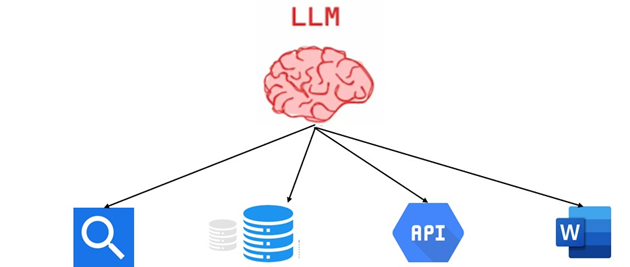
</p>

> **La metáfora clave:** `🧠 Cerebro (LLM) + 🦾 Bracitos (herramientas) = Agente`. El cerebro razona; los brazos actúan sobre el mundo.

---

## 2. Agente vs. LLM puro

Es fundamental distinguir ambos conceptos, porque un agente **se construye sobre** un LLM, pero no es lo mismo.

| | **LLM puro** | **Agente de IA** |
|---|---|---|
| Función principal | Generar texto coherente | Decidir y actuar de forma autónoma |
| Mecanismo | Predice el token más probable | Usa el LLM para razonar y elegir acciones |
| Acceso al mundo | No ejecuta código ni APIs | Percibe el entorno y usa herramientas |
| Estado | Sin memoria persistente | Mantiene contexto y memoria |
| Comportamiento | Estático | Autónomo y adaptativo |

Un LLM por sí solo es como un cerebro **sin cuerpo**: puede pensar y redactar, pero no puede consultar el clima real, escribir en una base de datos o enviar un correo. El agente es lo que le da ese cuerpo.

---

## 3. Conceptos clave

Los sistemas de agentes de IA son **entidades autónomas** diseñadas para realizar tareas específicas. En esencia se basan en cuatro capacidades:

- **Percepción.** El agente comienza recopilando información de su entorno y de distintas fuentes —sensores, bases de datos, interfaces de usuario—. Esto puede implicar analizar texto, imágenes o cualquier otro tipo de datos para comprender la situación.
- **Razonamiento.** Con el LLM, el agente analiza los datos recopilados para comprender el contexto, identificar la información pertinente y formular posibles soluciones. Ejemplo: si el objetivo es agendar una reunión, el LLM analiza correos para identificar asistentes, horarios disponibles y propósito.
- **Planificación.** Usa la información recopilada para desarrollar un plan: establecer objetivos, dividirlos en pasos más pequeños y descubrir la mejor manera de alcanzarlos.
- **Acción.** Según su plan, ejecuta tareas, toma decisiones o interactúa con otros sistemas.

<p align="center">
  
</p>

Este ciclo es continuo: el agente **percibe** el ambiente (observaciones y experiencias anteriores), **razona y planifica** apoyándose en sus habilidades, metas y conocimiento previo, y ejecuta **acciones** que modifican el ambiente, generando nuevas observaciones.

---

## 4. Principales componentes de un agente

Todo agente se apoya en tres componentes esenciales:

### 4.1 Modelo
Los **LLMs** sirven de base para crear agentes: les dan la capacidad de entender, razonar y actuar. El LLM actúa como el **“cerebro”** del agente, procesando y generando lenguaje, mientras que otros componentes facilitan el razonamiento y la acción.

### 4.2 Herramientas
Las herramientas son **funciones o recursos externos** que el agente puede utilizar para interactuar con su entorno y ampliar sus capacidades: acceder a información, manipular datos o controlar sistemas externos. Se clasifican según su interfaz —física, gráfica o programable—. El *aprendizaje de herramientas* consiste en enseñar al agente a usarlas eficazmente: conocer sus funciones y el contexto en el que deben aplicarse.

### 4.3 Memoria
La memoria permite al agente **mantener el contexto, aprender de las experiencias y mejorar su rendimiento**. Tipos principales:

| Tipo | Para qué sirve |
|---|---|
| **Corto plazo** | Interacciones inmediatas y contexto de la conversación actual |
| **Largo plazo** | Datos y conversaciones históricas que persisten entre sesiones |
| **Episódica** | Registro de interacciones pasadas concretas de las que aprender |
| **De consenso** | Información **compartida entre agentes** en un sistema multiagente |

Recordando interacciones anteriores y adaptándose a situaciones nuevas, el agente evita “empezar de cero” en cada petición.

---

## 5. ¿Qué tan agéntico es un sistema?

Existe una discusión sin respuesta cerrada sobre **qué es y qué no es un agente de IA**. Como no hay un consenso universal, en lugar de preguntar “¿es o no es un agente?”, la pregunta útil es:

> **¿Qué tan agéntico es el sistema?**

Y eso lo determina el **nivel de autonomía y control** que el sistema tiene sobre sí mismo. A continuación, los cinco niveles de agencia, de menor a mayor:

<p align="center">
  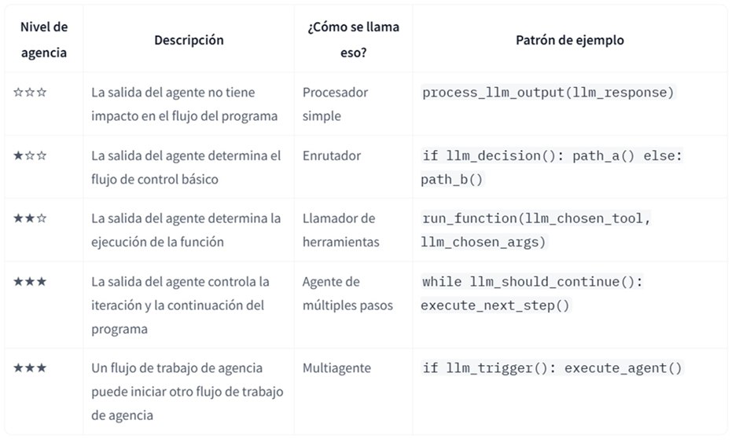
</p>

### Nivel 1 · Procesador simple (☆☆☆)
Imagina un **traductor automático**: le das un texto en español, lo procesa con su LLM interno y devuelve la versión en inglés. No toma decisiones, no cambia su comportamiento ni afecta el flujo del programa. Es como una calculadora lingüística: siempre hace lo mismo con lo que recibe. Su agencialidad es casi nula.

<p align="center">
  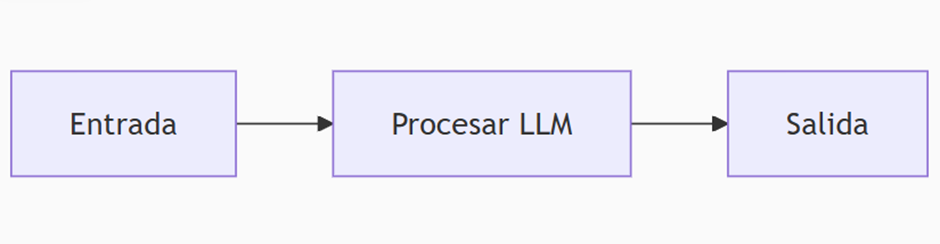
</p>

*Patrón de código:* `process_llm_output(llm_response)`

### Nivel 2 · Enrutador / Router (★☆☆)
Un **clasificador de consultas**: ante “¿Cómo configuro mi email?”, el agente decide entre dos caminos predefinidos —técnico (ruta A) o comercial (ruta B)—. No ejecuta acciones complejas, solo elige entre opciones fijas, como un semáforo. Su autonomía es básica.

<p align="center">
  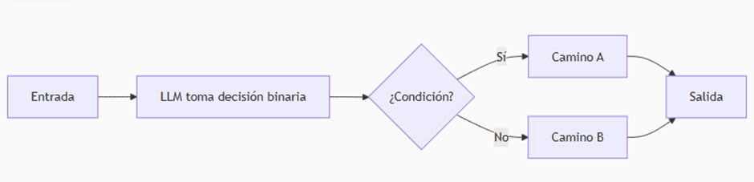
</p>

*Patrón de código:* `if llm_decision(): path_a() else: path_b()`

### Nivel 3 · Llamador de herramientas (★★☆)
Como un **asistente del clima**: ante “¿Lloverá en Bogotá?”, analiza si necesita una herramienta externa (una API meteorológica). Si es así, llama a esa función con los parámetros correctos (`ciudad=Bogotá`), procesa los datos y responde. Es el caso clásico del **“cerebro con brazos”**: decide qué acción tomar en tiempo real.

<p align="center">
  
</p>

*Patrón de código:* `run_function(llm_chosen_tool, llm_chosen_args)`

### Nivel 4 · Agente multipasos (★★★)
Un **solucionador de problemas matemáticos**: empieza con un enunciado y entra en un ciclo de decisiones iterativas. En cada paso piensa una acción (ej.: “calcular integral”), la ejecuta, guarda resultados en su memoria y decide si continúa o termina. Tiene alta autonomía porque **planea, actúa y aprende** del contexto acumulado.

<p align="center">
  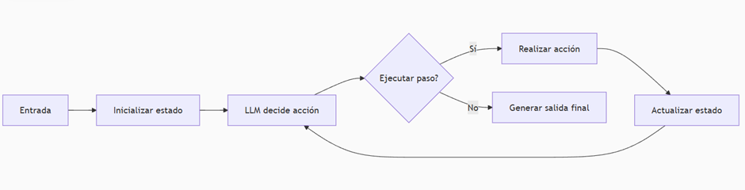
</p>

*Patrón de código:* `while llm_should_continue(): execute_next_step()`

### Nivel 5 · Sistema multiagente (★★★★)
Como un **equipo de trabajo**: un agente supervisor recibe “Planificar un viaje a París”. Si necesita expertos, llama a sub-agentes especializados —uno busca vuelos, otro hoteles, otro itinerarios—. Coordina sus respuestas y sintetiza el resultado final. Es la máxima autonomía: un **director de orquesta** que gestiona talentos diversos.

<p align="center">
  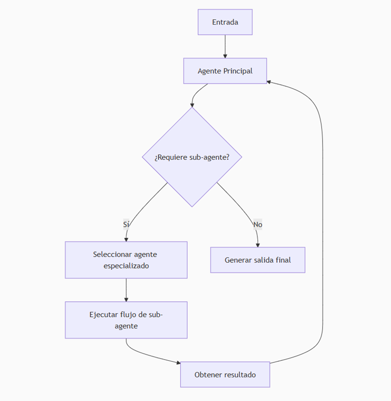
</p>

*Patrón de código:* `if llm_trigger(): execute_agent()`

---

## 6. Patrones de diseño

Los niveles anteriores se implementan con **patrones** concretos. Los tres más importantes para empezar son ReAct, Plan-and-Execute y Router.

### 6.1 ReAct — *Reason + Act*

ReAct combina la **capacidad de razonamiento** del LLM con la **ejecución** de herramientas externas. El corazón del patrón es un ciclo simple pero poderoso: **Thought → Action → Observation**, que se repite hasta poder dar una respuesta con confianza.

<p align="center">
  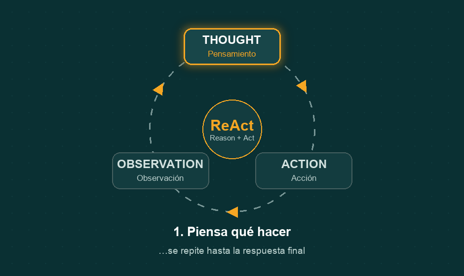
</p>

1. **Thought (pensamiento).** El LLM genera no solo una acción, sino también el **razonamiento** detrás de ella: es el agente “hablando consigo mismo”, explicando su plan o su comprensión actual.
2. **Action (acción).** El agente usa herramientas o APIs para ejecutar la acción planeada.
3. **Observation (observación).** Ve el resultado de su acción. Esta observación se realimenta directamente en el siguiente *Thought*.
4. **Iteración.** Si la observación es inesperada o hay un error, el agente razona por qué ocurrió y prueba otro enfoque. Aprende de sus experiencias, aunque sean pasos temporales.

**Ventajas.** Se puede **trazar su cadena de razonamiento** para entender cómo llegó a una conclusión → agentes más fiables y auditables. Al razonar antes de cada acción y observar resultados, se adapta dinámicamente en vez de seguir un plan rígido. **ReAct es el default recomendado para la mayoría de agentes simples.**

### 6.2 Plan-and-Execute

Este patrón **desacopla la planificación de la ejecución** y se compone de dos piezas:

- **Planner (planificador).** Un LLM genera **por adelantado** un plan de varios pasos para completar toda la tarea.
- **Executor (ejecutor).** Toma la consulta del usuario y cada paso del plan e invoca una o más herramientas para completarlo. Si es necesario, se **re-planifica**.

**ReAct vs. Plan-and-Execute:**

| | **ReAct** | **Plan-and-Execute** |
|---|---|---|
| Planeación | Un paso a la vez | Todo el plan primero |
| Ideal para | Entornos inciertos, adaptación en tiempo real | Flujos largos, estructurados, con dependencias entre pasos |
| Debilidad | Visión “cortoplacista” (solo mira un paso) | Menos flexible si el entorno cambia mucho |
| Costo | Más llamadas al modelo grande | Más económico: modelos pequeños por paso; el grande solo planifica y cierra |

En la práctica: **ReAct** es el default para tareas simples e interactivas; **Plan-and-Execute** brilla en flujos complejos donde conviene “pensar todo el camino” antes de empezar.

### 6.3 Router

El patrón **Router** usa el LLM como un **enrutador inteligente**: clasifica la petición y la dirige al camino o especialista adecuado, **sin ejecutar la tarea él mismo**. Decide entre rutas predefinidas (A / B / C…), redirige el flujo y es la base de las arquitecturas de **supervisor** y multiagente. Es simple, barato y muy controlable.

<p align="center">
  
</p>

---

## 7. Function Calling en detalle

Los modelos de lenguaje sirven **únicamente para generar texto** coherente ante una petición: por sí mismos **no pueden correr código, llamar a herramientas externas ni conectarse a bases de datos**. Para resolver esto se introdujo el concepto de **Function Calling**.

> **Function Calling** es la capacidad de un LLM para **identificar cuándo necesita ejecutar una acción externa** —pedir datos actualizados, realizar cálculos o invocar una API— y luego **generar una llamada estructurada** (normalmente en JSON) indicando qué función usar y con qué argumentos.

Cuando procesa una instrucción, el modelo determina de forma inteligente si se necesita una herramienta y, de ser así, genera datos estructurados que especifican **la herramienta a llamar y sus parámetros**.

Las llamadas a función permiten dos casos de uso principales:

- **Recuperación de datos.** Traer información actualizada para las respuestas del modelo: el clima actual, conversión de divisas o datos específicos de bases de conocimiento y APIs (**RAG**).
- **Tomar medidas.** Realizar operaciones externas: enviar formularios, actualizar el estado de la aplicación o coordinar flujos de trabajo de agentes (por ejemplo, transferencias de conversaciones).

<p align="center">
  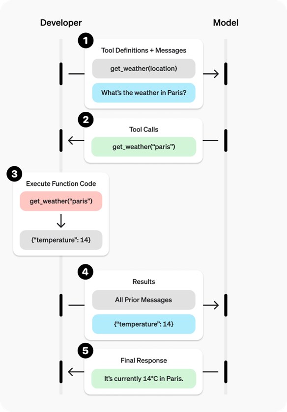
</p>

### 7.1 Cómo funciona, paso a paso

1. El **usuario** le da una instrucción al agente.
2. El **modelo** analiza qué es lo que necesita el usuario.
3. El modelo revisa su **lista de tools** (previamente configuradas) y verifica si necesita usar alguna para responder.
4. Si identifica que necesita una tool, **genera una estructura** que el sistema entiende para llamar a esa función.
5. El **sistema ejecuta** la función y obtiene un resultado.
6. El resultado se **devuelve al modelo**, que ya tiene el contexto de la pregunta; con esa respuesta redacta la contestación final al usuario.

<p align="center">
  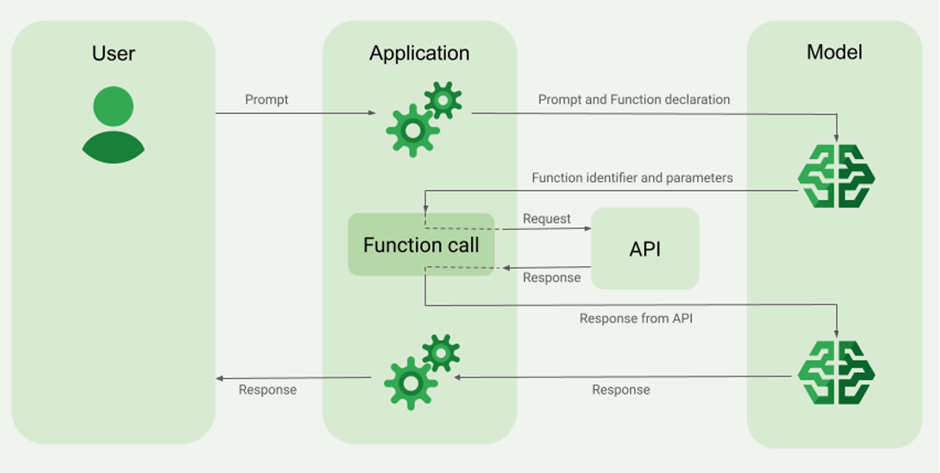
</p>

### 7.2 Ejemplo: `get_weather`

Supongamos que el usuario pide el clima en un lugar del mundo. El modelo identifica que debe usar una herramienta que dé el clima indicando la **locación** (dicha herramienta debe existir), llamada `get_weather`, y que el usuario quiere el clima en **París**. El modelo produce una salida estructurada así:

```json
[{
  "type": "function_call",
  "id": "fc_12345xyz",
  "call_id": "call_12345xyz",
  "name": "get_weather",
  "arguments": "{\"location\":\"Paris, France\"}"
}]
```

Con esto, el sistema agéntico entiende que debe llamar a `get_weather` con el parámetro `"Paris, France"`. Una vez ejecutada la función y obtenido el resultado, este se lleva de nuevo al LLM —que ya tiene el contexto de la pregunta y sabe que llamó a una herramienta—; con esa respuesta ya puede **responder la pregunta del usuario**.

---

## 8. Sistemas y arquitecturas multiagente

A medida que estos sistemas se desarrollan, pueden volverse **más complejos**, lo que dificulta su gestión y escalabilidad. Suelen aparecer problemas como:

- El agente tiene **demasiadas herramientas** y toma malas decisiones sobre cuál llamar.
- El **contexto se vuelve demasiado complejo** para que un solo agente lo siga.
- Se necesitan **varias áreas de especialización** (planificador, investigador, experto en matemáticas, etc.).

La solución es **dividir la aplicación en varios agentes independientes más pequeños** y componerlos en un sistema multiagente.

<p align="center">
  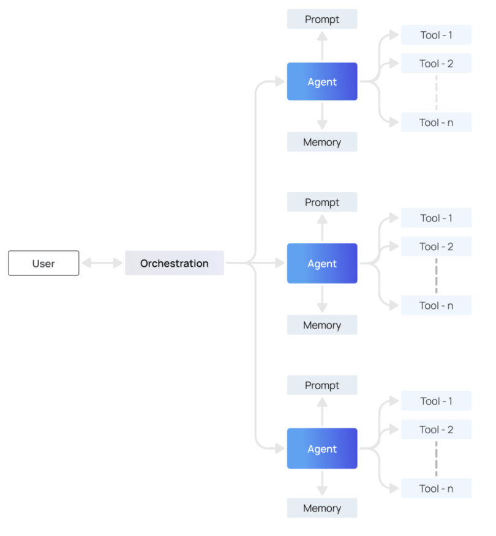
</p>

**Beneficios principales:**

- **Modularidad.** Agentes separados → más fácil desarrollar, probar y mantener.
- **Especialización.** Puedes crear agentes expertos centrados en dominios concretos, lo que mejora el rendimiento global.
- **Control.** Controlas explícitamente cómo se comunican los agentes (en lugar de depender solo de la llamada de funciones).

### 8.1 Arquitecturas multiagente

Hay varias formas de conectar agentes en un sistema multiagente:

- **Red (network).** Cada agente puede comunicarse con todos los demás; cualquiera decide a qué otro agente llamar a continuación.
- **Supervisor.** Cada agente se comunica con un único agente **supervisor**, que decide a quién llamar.
- **Supervisor (llamada a herramientas).** Caso especial del anterior: los agentes se representan como **herramientas** y el supervisor usa un LLM con *tool calling* para decidir a qué agente-herramienta llamar y con qué argumentos.
- **Jerárquica.** Un sistema con **supervisor de supervisores**; generaliza la arquitectura de supervisor y permite flujos de control más complejos.
- **Flujo personalizado (custom).** Cada agente se comunica solo con un subconjunto de agentes; algunas partes del flujo son deterministas y solo algunos agentes deciden a quién llamar.

<p align="center">
  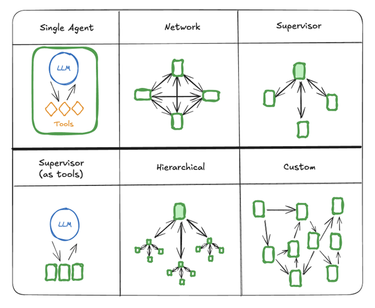
</p>

---

## Glosario

- **Agente de IA.** Sistema que usa un LLM para decidir y actuar de forma autónoma sobre su entorno mediante herramientas.
- **LLM (Large Language Model).** Modelo de lenguaje que genera texto prediciendo el siguiente token. Es el “cerebro” del agente.
- **Herramienta / Tool.** Función o recurso externo (API, base de datos, búsqueda…) que el agente puede invocar.
- **Function Calling.** Capacidad del LLM de generar una llamada estructurada (JSON) que indica qué función usar y con qué argumentos.
- **ReAct.** Patrón de bucle *Thought → Action → Observation* que alterna razonamiento y acción.
- **Plan-and-Execute.** Patrón que separa un *planner* (crea el plan completo) de un *executor* (ejecuta cada paso).
- **Router.** Patrón donde el LLM clasifica y redirige la petición a un camino o especialista.
- **Sistema multiagente.** Conjunto de agentes especializados que colaboran, normalmente coordinados por una capa de orquestación o un supervisor.
- **Nivel de agencia.** Grado de autonomía y control que un sistema tiene sobre su propio flujo de ejecución.

---

## Fuentes

- Google Cloud — *What is agentic AI?* — https://cloud.google.com/discover/what-is-agentic-ai?hl=es-419
- LangChain — *What is an agent?* — https://blog.langchain.com/what-is-an-agent/
- LangChain — *How and when to build multi-agent systems* — https://blog.langchain.com/how-and-when-to-build-multi-agent-systems/
- LangChain — *Plan-and-Execute Agents* — https://www.langchain.com/blog/planning-agents
- OpenAI — *Function calling guide* — https://platform.openai.com/docs/guides/function-calling?api-mode=responses
- Google Vertex AI — *Function calling* — https://cloud.google.com/vertex-ai/generative-ai/docs/multimodal/function-calling?hl=es-419
- LangGraph — *Multi-agent concepts* — https://langchain-ai.github.io/langgraph/concepts/multi_agent/

---

<p align="center"><em>Cypher · Formaciones en Inteligencia Artificial — “sin conservantes ni colorantes ;)”</em></p>
