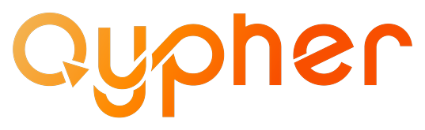
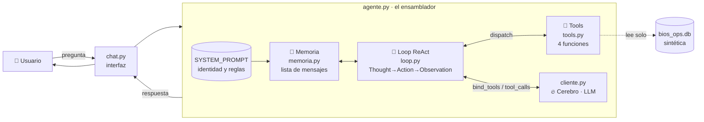
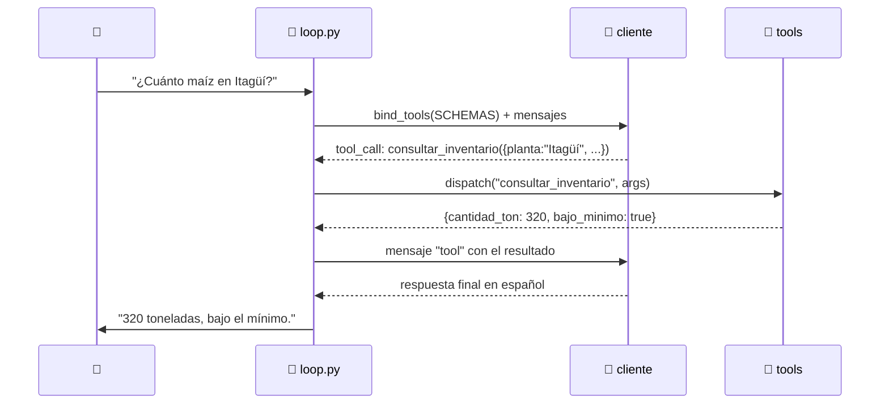
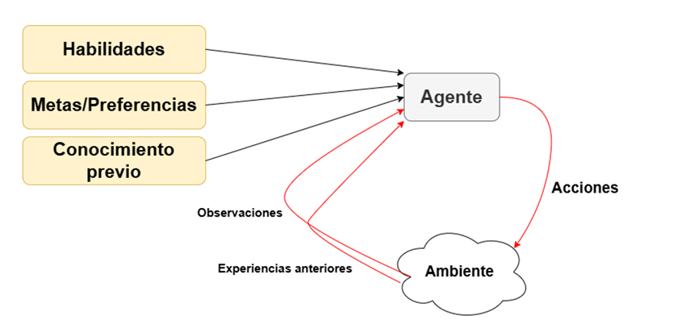
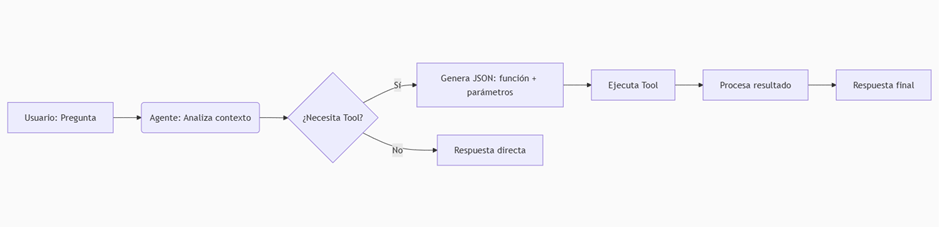
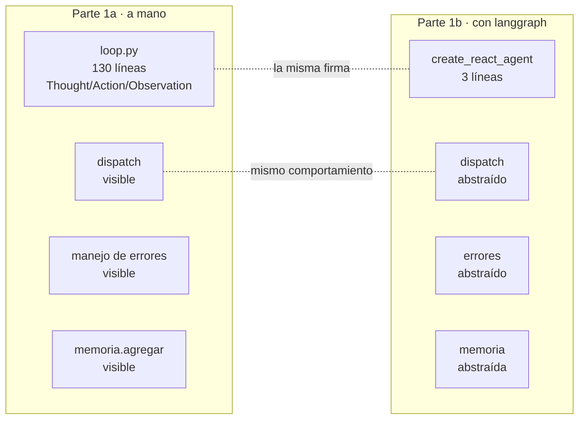

# Sesión 2 · Cómo se construye un Agente de IA

**Formación en Inteligencia Artificial — Grupo Bios**
_Programa Cypher · Stack: Python · LangChain · N8N_

<p align="center">
  
</p>

> **Cómo usar este documento.** Es el *ebook* de la segunda clase: acompaña la
> demo en vivo y sirve para reproducirla por tu cuenta después. Cada sección
> muestra una pieza del agente, la coteja con el concepto que vimos en la sesión 1
> y añade notas prácticas. La idea no es que entiendan todo el código, sino que
> **vean dónde vive cada concepto** — el cerebro, las tools, la memoria, el loop
> ReAct — y reconozcan que el agente es la **composición** de esas piezas, no
> magia.

> **Esta semana.** La sesión 1 respondió *qué es* un agente de IA: un cerebro
> (LLM) con unos bracitos (herramientas) que decide y actúa por su cuenta. Vimos
> la metáfora, los componentes, los niveles de agencia y el patrón ReAct — todo
> con dibujos.
>
> La sesión 2 responde *cómo se construye ese mismo agente*, pieza por pieza, en
> Python. La meta no es que entiendan el código entero, ni que lo expliquen línea
> por línea. La meta es que **vean dónde vive cada concepto** que vimos la semana
> pasada — el cerebro, las tools, la memoria, el loop ReAct — y reconozcan que el
> agente es la **composición** de esas piezas, no magia.
>
> `🧠 Cerebro (LLM) + 🦾 Bracitos (tools) + 📝 Memoria = Agente`. La semana pasada
> lo dibujamos. Hoy lo escribimos.

---

## Contenido

1. [El agente que vamos a construir](#1-el-agente-que-vamos-a-construir)
2. [`cliente.py` — el cerebro](#2-clientepy--el-cerebro)
3. [`tools.py` — los bracitos](#3-toolspy--los-bracitos)
4. [Function Calling en concreto](#4-function-calling-en-concreto)
5. [`memoria.py` — la memoria](#5-memoriapy--la-memoria)
6. [`loop.py` — el ciclo ReAct](#6-loppy--el-ciclo-react)
7. [`agente.py` — ensamblar + la salvaguarda](#7-agentepy--ensamblar--la-salvaguarda)
8. [`chat.py` — la interfaz es lo de menos](#8-chatpy--la-interfaz-es-lo-de-menos)
9. [¿Qué nivel de agencia construimos?](#9-qu%C3%A9-nivel-de-agencia-construimos)
10. [El MISMO agente con framework](#10-el-mismo-agente-con-framework)
11. [Puente a la Sesión 3](#11-puente-a-la-sesi%C3%B3n-3)

---

## 1. El agente que vamos a construir

Un agente de IA es, en su forma más simple, **cuatro piezas cableadas en un
ciclo**:

- un **cerebro** (el LLM, que razona y decide),
- unas **herramientas** (funciones que ejecutan acciones concretas),
- una **memoria** (los turnos anteriores, para no empezar de cero),
- un **loop** (decide → actúa → observa → decide de nuevo).

Y alrededor, dos cosas: una **interfaz** (terminal, web, lo que sea) que recibe
la pregunta del usuario y devuelve la respuesta, y un **ensamblador** que junta
las cuatro piezas. Eso es todo.



Seis archivos, un concepto cada uno. Vamos a recorrerlos en ese orden: primero
el cerebro, luego las tools, la memoria y el loop, y al final el ensamblador y la
interfaz. Cuando lleguemos al cierre verán que **cada concepto que vimos como
dibujo en la clase 1 está aquí, en código, y se señala con el dedo**.

> **Dónde está el código.** Todo lo que verán vive en
> `clase2-como-construir-agente/agente-transparente/`. Seis archivos. Si abren la
> carpeta en VS Code, ven los seis en el explorador lateral: `cliente`, `tools`,
> `memoria`, `loop`, `agente`, `chat`. Ese orden de lectura no es casualidad — es
> el del recorrido de hoy.

---

## 2. `cliente.py` — el cerebro

En la clase 1 dijimos:

> *El LLM actúa como el **"cerebro"** del agente, procesando y generando
> lenguaje, mientras que otros componentes facilitan el razonamiento y la
> acción.* — §4.1

<p align="center">
  
</p>

Acá está ese cerebro. `cliente.py` es el archivo más corto del agente y,
conceptualmente, el más importante: **instanciar el LLM**. Toma las credenciales
de un `.env` y devuelve un objeto `cliente` que ya sabe hablar con el proveedor
de modelos. Si mañana Bios cambia de proveedor, cambias este archivo y nada más.

```python
import os
from pathlib import Path
from dotenv import load_dotenv
from langchain_openai import ChatOpenAI

# Carga el .env del directorio del proyecto (sube dos niveles desde este archivo).
load_dotenv(Path(__file__).resolve().parents[1] / ".env")

# Plantilla de aviso: la falta de credenciales se detecta al cargar, no en runtime.
_REQUERIDAS = ("AZURE_OPENAI_ENDPOINT", "AZURE_OPENAI_API_KEY", "AZURE_OPENAI_DEPLOYMENT")
_faltan = [k for k in _REQUERIDAS if not os.getenv(k)]
if _faltan:
    raise SystemExit(
        "Faltan variables de entorno requeridas: "
        + ", ".join(_faltan)
        + ". Copia .env.example a .env y complétalas."
    )

cliente = ChatOpenAI(
    base_url=os.environ["AZURE_OPENAI_ENDPOINT"],
    api_key=os.environ["AZURE_OPENAI_API_KEY"],
    model=os.environ["AZURE_OPENAI_DEPLOYMENT"],
    temperature=0.2,
)
```

**Qué se ve aquí:**

- **Tres variables.** El agente recibe al mundo exterior por tres envvars:
  `endpoint`, `api_key`, `deployment`. Lo demás es Python de plomería. El `.env`
  vive fuera del git (está en `.gitignore`) y nunca se proyecta en clase — si
  hay que mostrar el formato, se proyecta `.env.example` con valores ficticios.
- **`temperature=0.2`.** Baja temperatura → menos invención. En la clase 1 vimos
  que un LLM sin datos inventa con seguridad; aquí queremos que razone, no que
  imagine cifras operativas.
- **`ChatOpenAI` con `base_url`.** En esta iteración, Bios entró por **Azure AI
  Foundry** (`*.services.ai.azure.com/openai/v1`), que es compatible con la API
  de OpenAI estándar. Por eso usamos `ChatOpenAI` apuntando `base_url` al endpoint
  de Foundry y `model` al nombre del deployment. Si Bios cambia a Azure OpenAI
  clásico otro día, basta con reemplazar este bloque por `AzureChatOpenAI(...)` —
  el resto del agente no se toca. Esa es la magia de aislar el cliente en su
  propio archivo.

> **Lección para llevarse.** El cerebro del agente son 10 líneas. La
> abstracción que más les convierte es **poner el proveedor en un solo archivo**:
  llamar al LLM en cualquier parte del código sería un nudo imposible de migrar.

---

## 3. `tools.py` — los bracitos

En la clase 1 dijimos:

> *Las herramientas son **funciones o recursos externos** que el agente puede
> utilizar para interactuar con su entorno y ampliar sus capacidades.* — §4.2

<p align="center">
  
</p>

Aquí los brazos. Cuatro funciones, una por cada dominio del negocio que modeló
el laboratorio de la clase 1:

| Tool | Dominio (reto Bios) | Qué devuelve |
|---|---|---|
| `consultar_inventario` | Compras | Inventario de materias primas de una planta |
| `consultar_demanda` | Producción / TD | Demanda histórica de producto, en toneladas |
| `estado_pedido` | Logística | Estado de un pedido ("interfaz tipo aeropuerto") |
| `historial_fallas` | Mantenimiento | Órdenes de mantenimiento recientes de una planta |

Cada una es una función Python común, con su docstring, que abre `bios_ops.db` en
modo solo lectura y devuelve un `dict`. Veamos una:

```python
def consultar_inventario(planta: str, materia_prima: str | None = None) -> dict:
    """Consulta el inventario de materias primas de una planta al último corte.

    Devuelve, por cada materia prima, la cantidad disponible en toneladas, el
    stock mínimo definido para esa planta y si está por debajo de ese mínimo.

    Usa esta herramienta para saber CUÁNTO HAY de una materia prima. Para saber
    cuánto se NECESITA en un período, usa `consultar_demanda` indicando la misma
    materia prima.

    Args:
        planta: Nombre, municipio o código de la planta. Acepta 'Itagüí',
            'Planta Itagüí' o 'PL-ITG'.
        materia_prima: Opcional. Nombre o código de una materia prima concreta,
            por ejemplo 'maíz' o 'MP-MAIZ'. Si se omite, devuelve todas.
    """
    p = _resolver_planta(planta)
    if not p:
        return _sin_planta(planta)
    # ... abre sqlite, consulta, arma el dict ...
    return salida
```

**Qué se ve aquí:**

- **La docstring es un prompt, no un comentario.** Esto va a ser la lección más
  útil del día: el LLM **no ve el código** de la función. Ve la docstring. Si el
  agente no usa la herramienta correcta, casi siempre la culpa es de esta
  docstring — está redactada para el desarrollador en vez de para el modelo.
  Mirenla con eso en mente: *"Usa esta herramienta para saber CUÁNTO HAY"* — eso
  es instrucción directa al LLM, no documentación para un humano.
- **Una tool por dominio.** No hay 40 funciones ni tools genéricas. Hay cuatro,
  alineadas con los retos de Bios. En sus proyectos reales empiezan con una, no
  con veinte.
- **"No encontré" es una respuesta, no un error.** Fíjense en el `return
  _sin_planta(planta)` — si la planta no existe, la tool devuelve un `dict` con
  un mensaje claro. **No levanta excepción**. Un agente no sabe qué hacer con un
  `KeyError`; sí sabe qué hacer con un `{"mensaje": "No encontré la planta..."}`.
- **Solo lectura.** La conexión a `bios_ops.db` se abre con `?mode=ro` — el
  driver sqlite rechaza cualquier escritura. Es una decisión: un agente no escribe
  en la base en esta sesión. Cuando un proyecto lo amerite, se abre en
  acompañamiento (S5–S7).

> **Lección para llevarse.** Las herramientas son funciones Python. Nada
> especial. La "magia" no está en que sean tools; está en **cómo se las damos al
> LLM**. Eso es Function Calling, y es lo que veremos ahora.

---

## 4. Function Calling en concreto

En la clase 1 vimos Function Calling como una idea abstracta con esta imagen:

<p align="center">
  
</p>

Y con un ejemplo mínimo: el usuario pide el clima en París y el modelo devuelve
este JSON:

```json
[{
  "type": "function_call",
  "name": "get_weather",
  "arguments": "{\"location\":\"Paris, France\"}"
}]
```

Hoy vemos dónde vive eso en el código. En `tools.py`, al final del archivo, hay
una lista que se llama `SCHEMAS`. Esa es la lista que **el agente le pasa al
modelo** para que sepa qué herramientas existen, qué hacen y qué argumentos
reciben. Miremos una:

```python
SCHEMAS = [
    {
        "type": "function",
        "function": {
            "name": "consultar_inventario",
            "description": consultar_inventario.__doc__.split("\n\n")[0].strip(),
            "parameters": {
                "type": "object",
                "properties": {
                    "planta": {
                        "type": "string",
                        "description": "Nombre, municipio o código de la planta.",
                    },
                    "materia_prima": {
                        "type": "string",
                        "description": "Opcional. Nombre o código de la materia prima.",
                    },
                },
                "required": ["planta"],
            },
        },
    },
    # ... otras 3 ...
]
```

**Ese es el JSON `get_weather` de la clase 1, pero de verdad.** Comparen:

| Clase 1 (ejemplo) | Clase 2 (código real) |
|---|---|
| `"name": "get_weather"` | `"name": "consultar_inventario"` |
| `"arguments": "{\"location\":\"Paris, France\"}"` | `"properties": {"planta": {...}, "materia_prima": {...}}` |
| `(imaginado)` | `SCHEMAS = [...]` se pasa a `cliente.bind_tools(SCHEMAS)` |

La docstring de la función — *"Consulta el inventario de materias primas..."* —
se inyecta como el campo `description` del schema. **Modelo y humano ven la
misma phrase**. Si la docstring dice bien qué hace la tool, el modelo la usa
bien. Si dice mal, el modelo la usa mal. La docstring es un prompt, y aquí se ve
mecánicamente.

Eso es Function Calling: el JSON `get_weather` de la clase 1, pero de verdad.
Cuando lleguemos al loop (sección 6) verán las cinco líneas de código que
implementan este flujo — `bind_tools`, `invoke`, `tool_calls`, `dispatch`.

---

## 5. `memoria.py` — la memoria

En la clase 1 vimos que la memoria permite al agente **mantener el contexto y no
empezar de cero en cada turno**, con cuatro tipos principales:

| Tipo | Para qué sirve |
|---|---|
| **Corto plazo** | Interacciones inmediatas y contexto de la conversación actual |
| **Largo plazo** | Datos y conversaciones históricas que persisten entre sesiones |
| **Episódica** | Registro de interacciones pasadas concretas de las que aprender |
| **De consenso** | Información **compartida entre agentes** en un sistema multiagente |

— §4.3

La memoria de hoy es la más simple de todas: **corto plazo**. Y es
deliberadamente simple, para que el concepto se vea sin distracciones.

```python
class Memoria:
    """Un buffer de mensajes en formato OpenAI.

    Formato que devuelve `mensajes()`:
        [{"role": "system", "content": "..."},
         {"role": "user",   "content": "..."},
         {"role": "assistant", "content": "..."},
         {"role": "tool", "tool_call_id": "...", "content": "..."}]
    """

    def __init__(self, system_prompt: str = ""):
        """Arranca con el mensaje de sistema (la identidad y reglas del agente)."""
        self._mensajes: list[dict] = (
            [{"role": "system", "content": system_prompt}] if system_prompt else []
        )

    def agregar(self, rol: str, contenido: str | None = None, **extra) -> None:
        """Agrega un mensaje.

        rol: 'system' | 'user' | 'assistant' | 'tool'.
        contenido: el texto del mensaje.
        **extra: campos adicionales (ej. `tool_calls`, `tool_call_id`).
        """
        msg = {"role": rol}
        if contenido is not None:
            msg["content"] = contenido
        msg.update(extra)
        self._mensajes.append(msg)

    def mensajes(self) -> list[dict]:
        """Devuelve la lista —la memoria es eso: se pasa al LLM en la próxima llamada."""
        return self._mensajes
```

**Qué se ve aquí:**

- **La memoria es una lista de mensajes.** Eso es todo. Cuando alguien les diga
  que un agente "tiene memoria", piensen en esta clase: 50 líneas, una lista de
  dicts, dos métodos. La "memoria" **no es un oráculo** — es el historial de la
  conversación, en el formato OpenAI, que se le pasa de vuelta al LLM en cada
  llamada.
- **No persiste.** Al cerrar el script, la lista se pierde. **Esto es corto
  plazo**, justo la primera fila de la tabla de la clase 1. La persistencia
  (Redis, SQLite, Postgres) es un problema distinto y lo verán en sus proyectos
  reales durante el acompañamiento (S5–S7). Hoy lo dejamos afuera a propósito:
  la lección es *qué es* la memoria, no *cómo persistirla*.
- **El mensaje `tool` existe.** Miren el cuarto rol en la docstring: `tool`, con
  `tool_call_id`. Ese es el formato que usa OpenAI para devolverle al modelo el
  resultado de una herramienta. Si una conversación tiene un turno de
  herramienta, la memoria guarda un par "assistant pidió X / tool devolvió Y".
  Por eso la `agregar` acepta `**extra`: para meter `tool_calls` y
  `tool_call_id` cuando hace falta.

> **Lección para llevarse.** "Memoria" no es una base de datos mágica; es
> **volver a pasarle al LLM los mensajes anteriores**. Si mañana quieren memoria
> de largo plazo, **la abstracción es la misma**: un identificador de sesión y un
> almacenamiento. En n8n lo verán como un nodo *Window Buffer Memory*; en Python,
> como esta clase.

---

## 6. `loop.py` — el ciclo ReAct

En la clase 1 vimos el patrón ReAct como un bucle animado:

<p align="center">
  
</p>

> *Thought (pensamiento) → Action (acción) → Observation (observación), que se
> repite hasta poder dar una respuesta con confianza.* — §6.1

Ese gif es el corazón de la clase de hoy. Aquí está en código. `loop.py` es el
archivo más largo, y es el que la Parte 1b reemplazará con tres líneas de
framework. Por eso lo recorremos despacio — es la pieza que hace que **esto sea
un agente y no un chatbot**.

```python
def react(cliente, memoria, pregunta: str) -> str:
    """Ejecuta el ciclo ReAct sobre una pregunta. Devuelve el texto final."""
    memoria.agregar("user", pregunta)
    print(f"\n[user] {pregunta}")

    # `bind_tools` adjunta los schemas al LLM para que pueda decir "quiero usar X".
    llm = cliente.bind_tools(SCHEMAS)

    for iteracion in range(1, MAX_ITERACIONES + 1):
        print(f"\n── iteración {iteracion} ──")

        try:
            respuesta = llm.invoke(memoria.mensajes())
        except Exception as e:
            print(f"[error] La llamada al LLM falló: {e}")
            memoria.agregar("assistant", "No pude completar la consulta ...")
            return "Fallo en la llamada al LLM."

        msg = respuesta
        tool_calls = getattr(msg, "tool_calls", None) or []

        if not tool_calls:
            # Respuesta final — ya no necesita más tools.
            texto = msg.content or ""
            memoria.agregar("assistant", texto)
            print(f"\n[Respuesta] {texto}")
            return texto

        # Hay tool_calls: el LLM decidió qué herramienta usar.
        print(f"[Thought] {msg.content or '(sin texto explicativo)'}")

        memoria.agregar(
            "assistant", content=msg.content or "",
            tool_calls=[{ ... tc reformateado ... } for tc in tool_calls],
        )

        for tc in tool_calls:
            nombre = tc["name"]
            args = tc["args"]
            print(f"[Action]   {nombre}({json.dumps(args, ensure_ascii=False)})")

            try:
                resultado = dispatch(nombre, args)
            except Exception as e:
                resultado = {"error": f"Fallo ejecutando {nombre}: {e}"}

            print(f"[Observation] {json.dumps(resultado, ...)[:300]}")

            memoria.agregar(
                "tool",
                json.dumps(resultado, ensure_ascii=False, default=str),
                tool_call_id=tc["id"],
            )

    print(f"[corte] El agente no resolvió en {MAX_ITERACIONES} iteraciones.")
    return "Agente cortado por máximo de iteraciones."
```

Puede parecer denso, pero tiene **cuatro bloques** que se leen solos:

1. **`memoria.agregar("user", pregunta)`** — entra la pregunta del usuario a la
   memoria.
2. **`cliente.bind_tools(SCHEMAS)`** — le adjuntamos los schemas al LLM. Eso es
   Function Calling en una línea.
3. **El `for iteracion in range(...)`** — el bucle. Cada vuelta es una iteración
   del gif ReAct.
4. **`llm.invoke(memoria.mensajes())`** — la llamada al LLM. Acá se pasa **toda
   la memoria** —la lista que contiene system + user + turns anteriores— al
   cerebro. Por eso la memoria importa: sin esto el modelo no sabe qué se habló.

Los tres casos que hay dentro del `for` son el mapeo claro con el gif:

| En el gif | En el código |
|---|---|
| **Thought** 💭 | `[Thought] {msg.content}` — el modelo "habla consigo mismo". |
| **Action** 🛠️ | `[Action] consultar_inventario({...})` + `dispatch(...)` — ejecuta la tool. |
| **Observation** 👁️ | `[Observation] {resultado}` + `memoria.agregar("tool", ...)` — reinyecta al loop. |
| **Decisión de cierre** ✅ | `if not tool_calls:` — ya no necesita más tools, es la respuesta final. |

**Y la traza del terminal es el gif.** Cuando uno corre `python chat.py` y
escribe *"¿Cuánto maíz le queda a la planta de Itagüí?"*, lo que se imprime es:

```
[user] ¿Cuánto maíz le queda a la planta de Itagüí?

── iteración 1 ──
[Thought] (sin texto explicativo)
[Action]   consultar_inventario({"planta": "Itagüí", "materia_prima": "maíz"})
[Observation] {"planta": "Planta Itagüí", "fecha_corte": "2026-08-01",
               "items": [{"cantidad_ton": 320.0, "bajo_minimo": true, ...}], ...}
── iteración 2 ──

[Respuesta] A la planta Itagüí le quedan 320,0 toneladas de maíz amarillo ...
```

Miren esta traza al lado del gif. Es lo mismo. La diferencia es que uno es
dibujo animado y el otro es lo que pasó en la máquina. Por eso arrancamos la
clase 1 con el gif y cerramos con esta traza: el concepto **vive acá**.

El flujo completo entre un usuario y estas piezas, ya con nombres puestos:



Cada flecha de este diagrama es una línea del `loop.py` que acabamos de leer.
Este es el "camino completo de una llamada" de Function Calling (sección 4) —
ahora con los participantes presentados.

Los detalles que conviene señalar, no explicar línea por línea:

- **`MAX_ITERACIONES = 5`.** Un agente no puede pensar para siempre. Si no
  resuelve en 5 vueltas, corta y avisa. Es la salvaguarda más básica contra
  loops infinitos.
- **`try/except` alrededor del invoke.** Si Azure se cae, el agente no muere:
  informa *"No pude completar la consulta... "*. Esto va a pasar en sus
  proyectos; el manejo de errores es parte del agente, no un accesorio.
- **`getattr(msg, "tool_calls", None)`** — el LLM responde con un objeto que
  podría o no tener `tool_calls`. Si no tiene, es la respuesta final. Si tiene,
  son llamadas a herramientas.

> **Lección para llevarse.** El agente **es** este loop. Si lo entienden,
> entienden cómo se construye un agente. El resto (cliente, tools, memoria) son
> insumos; el loop es lo que los orquesta. Por eso, cuando pasemos al framework,
> lo que va a abstraer es justo este archivo.

---

## 7. `agente.py` — ensamblar + la salvaguarda

En la clase 1 dijimos que el agente sigue un ciclo continuo de **percepción →
razonamiento → planificación → acción**:

<p align="center">
  
</p>

— §3

`agente.py` es el ensamblador: une cliente + memoria + tools + loop en una clase
chiquita, y le suma una pieza que no habíamos visto aún — **la identidad del
agente**, su `SYSTEM_PROMPT`.

```python
SYSTEM_PROMPT = """Eres un asistente de operaciones de Grupo Bios. Tu trabajo es
responder preguntas de negocio sobre inventario, demanda, logística y
mantenimiento usando las herramientas que se te dan.

REGLAS:
- NUNCA inventes una cifra operativa. Si una herramienta no te da el dato, di
  "no tengo esa información" y explica qué herramienta se necesitaría.
- Usa las herramientas SIEMPRE que la pregunta requiera un dato del negocio.
  No respondas con conocimiento general.
- Si la pregunta es ambigua, pide aclaración.
- Responde en español, con unidades (toneladas, días, COP).
- Eres exacto. No redondees sin decirlo.
"""


class AgenteReAct:
    """Un agente ReAct con memoria conversacional.

    Composición:
        cerebro    ← cliente (AzureChatOpenAI)
        memoria    ← buffer de mensajes en formato OpenAI
        herramientas ← las 4 tools de bios_ops.db
        decisión   ← el ciclo ReAct ( Thought → Action → Observation )
    """

    def __init__(self):
        self.cliente = cliente
        self.memoria = Memoria(system_prompt=SYSTEM_PROMPT)
        self.tools = TOOLS_FUNC

    def preguntar(self, pregunta: str) -> str:
        """Envía una pregunta al agente y devuelve su respuesta final."""
        return react(self.cliente, self.memoria, pregunta)
```

**Qué se ve aquí:**

- **Cuatro piezas cableadas.** El `__init__` cablea al cliente, la memoria, las
  tools. La composición es literalmente la que venía en el mermaid inicial. Si
  faltara una, esto no sería un agente — sería otra cosa.
- **`SYSTEM_PROMPT` es la identidad.** Es el primer mensaje que entra en la
  memoria (miren `Memoria(system_prompt=SYSTEM_PROMPT)` arriba) y le dice al LLM
  **qué es, para quién trabaja y bajo qué reglas**. Es de los archivos más
  subestimados en un agente, y es donde más control fino se gana.
- **La salvaguarda más barata.** Lean la primera regla del prompt:
  *"NUNCA inventes una cifra operativa"*. Esa línea, sola, evita que el agente
  responda "320 toneladas" cuando la tool no le dio el dato. Es mucho más barata
  que un sistema de validación, y es donde empieza el *control* del agente.

Mapeo con la clase 1, para que se vea que es lo mismo:

| Concepto clase 1 §3 | Dónde está en `agente.py` |
|---|---|
| **Percepción** (recopilar información) | `memoria` + la pregunta del usuario |
| **Razonamiento** (analizar, identificar) | `cliente` + el loop ReAct |
| **Planificación** (elegir siguiente paso) | `tool_calls` del modelo en cada iteración |
| **Acción** (ejecutar) | `tools` + `dispatch` |
| **Conocimiento previo** | `SYSTEM_PROMPT` (la identidad) |

> **Lección para llevarse.** Un agente es **composición**. No hay código
> misterioso — hay un cliente, una memoria, unas tools y un loop, conectados por
> una clase chiquita. La complejidad está en el loop y en la calidad del prompt,
  no en el número de archivos.

---

## 8. `chat.py` — la interfaz es lo de menos

```python
from agente import AgenteReAct

def main() -> None:
    print(_AVISO, end="\n\n")
    print(BANNER)

    agente = AgenteReAct()

    if "--demo" in sys.argv:
        for pregunta in _DEMO:
            agente.preguntar(pregunta)
        print("\n[fin del demo]")
        return

    while True:
        try:
            pregunta = input("\ntú › ").strip()
        except (EOFError, KeyboardInterrupt):
            print("\n\n[salida]")
            break
        if not pregunta:
            continue
        if pregunta.lower() in {"salir", "exit", "quit"}:
            print("\n[salida]")
            break
        agente.preguntar(pregunta)
```

**Qué se ve aquí:**

- **El `while` es la interfaz.** Una terminal, un `input()`, un `print`. **Toda
  la agencia vive en `AgenteReAct().preguntar(...)`**. Si mañana quieren cambiar
  la interfaz a una web con FastAPI, a un bot de Teams, a un chat de WhatsApp o a
  un workflow de n8n, este archivo es el que se reemplaza. El agente — el
  `AgenteReAct` — **no se toca**.
- **El agente recibe un string y devuelve un string.** Ese es el contrato. Si lo
  entienden así, entienden por qué decir "chatbot" o "agente web" o "agente de
  WhatsApp" no cambia nada del concepto: cambia el envoltorio, no el motor.

> **Lección para llevarse.** La interfaz es **lo de menos**. En la clase 1
> hablamos de niveles de agencia sin mencionar la interfaz; era por esto. La
  agencia vive en el loop y en las tools, no en si el usuario escribe en una
  terminal o en un navegador.

---

## 9. ¿Qué nivel de agencia construimos?

En la clase 1 vimos cinco niveles de agencia. Comparen con lo que acabamos de
construir:

<p align="center">
  
</p>

> *Nivel 3 · Llamador de herramientas (★★☆)* — "decide qué acción tomar en
> tiempo real". Patrón: `run_function(llm_chosen_tool, llm_chosen_args)`.

<p align="center">
  
</p>

> *Nivel 4 · Agente multipasos (★★★)* — "piensa una acción, la ejecuta, guarda
> resultados en su memoria y decide si continúa o termina". Patrón:
> `while llm_should_continue(): execute_next_step()`.

**Mapeo:**

| Componente de la clase 2 | Nivel clase 1 |
|---|---|
| Una iteración del loop (una tool call) | **Nivel 3** — el patrón `run_function(llm_tool, llm_args)` es literalmente `dispatch(nombre, args)`. |
| El `for iteracion in range(1, MAX_ITERACIONES+1)` | **Nivel 4** — el patrón `while llm_should_continue()` es nuestro `if not tool_calls: return`. |
| La memoria entre turnos | **Nivel 4** — "guarda resultados en su memoria y decide si continúa". |

> **Lo que construimos hoy es un agente Nivel 4.** Cada iteración del loop es una
> herramienta Nivel 3; el loop que las encadena lo lleva a Nivel 4. Si mañana le
> sumamos **otros agentes especializados** y uno supervisor que orquesta — como
> vimos en `nivel5-multiagente.png` — llegamos a Nivel 5. **Eso es la sesión 4.**

Las consecuencias:

- **No pretendían construir un sistema multiagente.** Construyeron un solo
  agente, multipasos, con memoria y tools — eso es Nivel 4, y es muchísimo más
  de lo que parece. La mayoría de proyectos reales de Bios arrancan acá.
- **Si una mesa se emociona y quiere llegar a Nivel 5**, ese salto se ve en la
  sesión 4 (Skills, MCP, multiagente supervisor). No es hoy. Hoy es tener
  **claro** qué es Nivel 4 para que Nivel 5 no se vuelva magia.

---

## 10. El MISMO agente con framework

Hasta aquí escribimos el loop a mano, archivo por archivo. Vamos a proyectar lo
que escribimos contra el mismo agente **con un framework** (LangGraph). La
sorpresa: es el mismo agente, en muchas menos líneas.



Miren la carpeta `agente-framework/` lado a lado con `agente-transparente/`.
**Tres archivos son idénticos**: `cliente.py`, `tools.py`, `memoria.py`. El
**único** que cambia es `agente.py`. Y miren qué dice:

```python
from langchain_core.tools import StructuredTool
from langgraph.prebuilt import create_react_agent

from cliente import cliente
from tools import (
    consultar_inventario, consultar_demanda, estado_pedido, historial_fallas,
)

SYSTEM_PROMPT = """Eres un asistente de operaciones de Grupo Bios. ..."""


def construir_agente():
    """Construye el mismo agente ReAct en 1 línea de framework."""
    herramientas = [
        StructuredTool.from_function(f) for f in (
            consultar_inventario, consultar_demanda,
            estado_pedido, historial_fallas,
        )
    ]
    return create_react_agent(cliente, herramientas, prompt=SYSTEM_PROMPT)
```

**Tres líneas efectivas.** Las otras son imports y renglones de help. Miren el
diff conceptual contra la Parte 1a:

| Concepto | Parte 1a (a mano) | Parte 1b (framework) |
|---|---|---|
| Cerebro | `cliente.py` | **idéntico** |
| Tools | `tools.py` | **idéntico** |
| Memoria | `memoria.py` | **idéntico** |
| Loop ReAct | `loop.py` (130 líneas) | `create_react_agent(...)` (3 líneas) |
| Dispatch | `dispatch(...)` visible | interno del framework |
| Manejo de errores | `try/except` explícito | interno |
| Agregar mensajes a memoria | `memoria.agregar(...)` a mano | interno |
| Llamar al agente | `agente.preguntar(pregunta)` | `agente.invoke({"messages": [user]})` |

> **El framework no es magia. Es lo que escribimos a mano, empaquetado.**

Eso es lo que cierra la Parte 1b. `create_react_agent` hace **exactamente** lo
que hace `loop.py`: bind_tools → invoke → si hay tool_calls, dispatch → memoria
→ vuelve. Solo que en vez de escribirlo, lo importás.

**¿Por qué no llegar siempre por framework?**

- **Cuando querés control fino** (reintentos custom, logging artesanal,
  decisiones sobre el loop), escribís a mano. Hay cosas que un framework
  abstrae demasiado y te las tapa.
- **Cuando querés velocidad**, framework. La mayoría de proyectos arrancan con
  framework y, si necesitan ese control, escriben a mano las partes críticas.

La decisión es de arquitectura y la visitamos proyecto por proyecto en el
acompañamiento (S5–S7). Lo importante hoy es **entender qué es lo que el
framework abstrae** — y por eso lo escribimos primero a mano.

---

## 11. Puente a la Sesión 3

Hoy el agente que construimos lee **datos estructurados**. Las tools consultan
`bios_ops.db`: tablas, cifras ordenadas, ids, fechas, toneladas. Para esa
consulta, el agente funciona perfecto.

Pero los proyectos reales de Bios no son solo tablas. Hay **manuales de
operación**, **políticas de mantenimiento**, **contratos con proveedores**,
**circulares internas** — documentos en lenguaje natural donde la información no
está en filas y columnas, sino en párrafos. Si le preguntas al agente de hoy
*"¿qué dice el manual sobre el mantenimiento preventivo del molino?"*, no va a
poder responder — su tools no leen documentos, leen SQL.

> **RAG** (*Retrieval-Augmented Generation*) es la capacidad que le agrega al
> agente para leer y contestar sobre documentos: trocea el documento, lo
> convierte a embeddings, los guarda en una vector store, y cuando el usuario
> pregunta recupera los fragmentos más relevantes y se los pasa al LLM como
> contexto.

Lo importante del puente: **no se tira nada de lo que vimos hoy**. El agente de
la sesión 3 es **el mismo agente que construyeron hoy**, con una tool nueva que
sabe leer documentos. El cerebro, la memoria, el loop ReAct y la composición
siguen ahí — solo se suman unos brazos nuevos.

| Clase | El agente… |
|---|---|
| **S1** (qué es un agente) | lo dibujamos |
| **S2** (cómo se construye) | lo escribimos y lo corremos, contra tablas |
| **S3** (RAG) | le agregamos brazos que leen documentos |
| **S4** (agéntico) | lo multiplicamos: varios agentes colaborando |

**El cierre conceptual en una frase:** *si entienden lo que construimos hoy,
entienden la base de todo lo que viene. Las próximas clases lo extienden, no lo
rehacen.*

---

### Recapitulemos los cinco conceptos que vimos (60 segundos)

1. **El cerebro** — un LLM, instanciado en `cliente.py` (10 líneas).
2. **Las tools** — cuatro funciones en `tools.py`, una por dominio de Bios. Su
   docstring es un prompt, no un comentario.
3. **La memoria** — una lista de mensajes en `memoria.py`. Corto plazo. No
   persiste, pero ya alcanza para encadenar turnos.
4. **El loop ReAct** — el ciclo Thought → Action → Observation en `loop.py`. **El
   agente es este loop.** Es lo que el framework abstrae en la Parte 1b.
5. **La interfaz** — `chat.py`. Lo de menos. El agente recibe un string y
   devuelve un string.

Y el bonus: **el `SYSTEM_PROMPT`** en `agente.py`. La identidad del agente y la
salvaguarda más barata — *"NUNCA inventes una cifra operativa"*.

**Para la próxima clase: abrí el repo. Recorré `loop.py` — es la pieza clave.
Cuando lo entiendas, sabés cómo se construye un agente. El `COMO-MONTARLO.md` te
guía paso a paso para correrlo en tu máquina.**

---

<p align="center"><em>Cypher · Formaciones en Inteligencia Artificial — “sin conservantes ni colorantes ;)”</em></p>