# Sesión 4 · Harness, Skills y MCP — de la conversación a la ejecución

**Formación en Inteligencia Artificial — Grupo Bios**
_Programa Cypher · Stack: OpenCode · Skills · MCP · N8N_

<p align="center">
  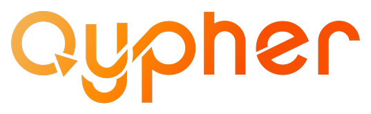
  &nbsp;&nbsp;&nbsp;&nbsp;
  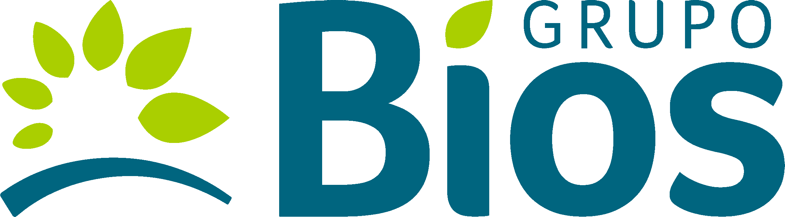
</p>

> **Cómo usar este documento.** Es el *ebook* de la cuarta y última clase
> formativa: acompaña la presentación (`Clase4.html`) y la demo en vivo, y
> sirve para reproducir todo por tu cuenta después. Cada sección explica
> una de las **tres piezas** que componen el salto de hoy — el Coding Agent,
> las Skills y los MCP — y cada pieza cierra con su práctica. Al final
> encontrarás el glosario, las fuentes y la guía de instalación.
>
> **La premisa de la sesión.** Hasta hoy *programamos* agentes: escribimos
> el loop, definimos las tools, montamos la memoria. Hoy damos un cambio de
> rol: **operamos un agente que ya está construido**. Ese agente controla
> nuestro computador — lee y escribe archivos, corre comandos, itera solo —
> y lo extendemos con dos capacidades nuevas: **Skills** (conocimiento
> empaquetado) y **MCP** (capacidades externas sin escribir código). Lo
> cerramos armando una automatización de n8n **hablando**, no arrastrando
> nodos.

---

## Contenido

1. [El arco del programa](#1-el-arco-del-programa)
2. [La pregunta de hoy](#2-la-pregunta-de-hoy)
3. [Pieza 1 · El Coding Agent](#3-pieza-1--el-coding-agent)
   - 3.1 [¿Qué es un harness?](#31-qué-es-un-harness)
   - 3.2 [Framework vs. harness](#32-framework-vs-harness)
   - 3.3 [La premisa: controlar el computador](#33-la-premisa-controlar-el-computador)
   - 3.4 [Cómo "piensa" el harness](#34-cómo-piensa-el-harness)
   - 3.5 [`AGENTS.md` — el contexto del proyecto](#35-agentsmd--el-contexto-del-proyecto)
   - 3.6 [El modelo de permisos](#36-el-modelo-de-permisos)
   - 3.7 [Tres harnesses, un patrón](#37-tres-harnesses-un-patrón)
   - 3.8 [Práctica transversal](#38-práctica-transversal)
4. [Pieza 2 · Skills](#4-pieza-2--skills)
   - 4.1 [Qué es una Skill](#41-qué-es-una-skill)
   - 4.2 [Para qué sirve](#42-para-qué-sirve)
   - 4.3 [Anatomía de un `SKILL.md`](#43-anatomía-de-un-skillmd)
   - 4.4 [Cómo se construye](#44-cómo-se-construye)
   - 4.5 [Dónde se guarda](#45-dónde-se-guarda)
   - 4.6 [Práctica: "analista operativo"](#46-práctica-analista-operativo)
5. [Pieza 3 · MCP](#5-pieza-3--mcp)
   - 5.1 [Qué es MCP](#51-qué-es-mcp)
   - 5.2 [Por qué se creó — el problema M×N](#52-por-qué-se-creó--el-problema-mn)
   - 5.3 [El estándar de comunicación agente↔herramienta](#53-el-estándar-de-comunicación-agenteherramienta)
   - 5.4 [Dónde se guarda y cómo se conecta](#54-dónde-se-guarda-y-cómo-se-conecta)
   - 5.5 [Práctica: dos MCPs](#55-práctica-dos-mcps)
6. [Cierre — n8n-cli + harness](#6-cierre--n8n-cli--harness)
7. [Las tres piezas en una frase](#7-las-tres-piezas-en-una-frase)
8. [Entregables](#8-entregables)
9. [Puente al acompañamiento S5–S7](#9-puente-al-acompañamiento-s5s7)
10. [Glosario](#10-glosario)
11. [Fuentes](#11-fuentes)

---

## 1. El arco del programa

Tres clases pasadas armamos tres capacidades. Hoy cerramos el ciclo con la
cuarta.

| Sesión | Pregunta | Qué construimos |
|---|---|---|
| **S1** | ¿Qué es un agente de IA? | Vocabulario, niveles de agencia, patrones |
| **S2** | ¿Cómo se construye un agente? | El loop ReAct a mano, `create_react_agent`, n8n |
| **S3** | ¿Cómo sabe cosas que no le contamos? | RAG, embeddings, vector DB, webhook |
| **S4 ← hoy** | **¿Y si el agente ya está construido y yo lo opero?** | **Harness + Skills + MCP** |
| S5–S7 | — | Acompañamiento de proyectos (sin clase) |

La progresión "de menos a más" que Bios buscaba desde el principio encaja
así: prototipo (S1) → funcional (S2) → datos (S3) → **agéntico, operando
un agente ya construido** (S4). La cuarta parada no es "un agente más
complejo" — es **un cambio de rol**: dejamos de programar el agente y
empezamos a operarlo.

---

## 2. La pregunta de hoy

Las tres sesiones anteriores te dejaron con una capacidad concreta: sabes
**programar** un agente. Escribir el loop, definir las tools, montar la
memoria, enchufarle un RAG. Eso es mucho — y es justo lo que necesitarás
para entender tus proyectos.

Pero los proyectos reales de los Champions no se resuelven programando otro
agente desde cero. Se resuelven **operando** un agente que ya está
construido, que lee y escribe archivos, corre comandos, itera solo y pide
permiso. Y extendiendo ese agente con dos capacidades nuevas:

- **Skills** — conocimiento procedimental empaquetado que el agente carga
  cuando entra en un dominio.
- **MCP** — un protocolo estándar para conectar capacidades externas (un
  sistema de tickets, una herramienta de diagramas, una base de datos) sin
  que tú escribas el código de la integración.

Ese es el salto de hoy. Y el cierre lo lleva al territorio más concreto: el
mismo harness armando una automatización de n8n **hablando**, en 3-5
minutos lo que antes tomaba 20-30 minutos de arrastrar nodos.

El mapa completo de la sesión cabe en una imagen — el **agente de código al
centro** (puede ser Claude Code, Codex u OpenCode), extendido por las
piezas que vamos a recorrer: **Skills** a la izquierda, **MCPs** arriba, la
**ejecución** sobre la terminal abajo y la memoria del contexto a la
derecha:

<p align="center">
  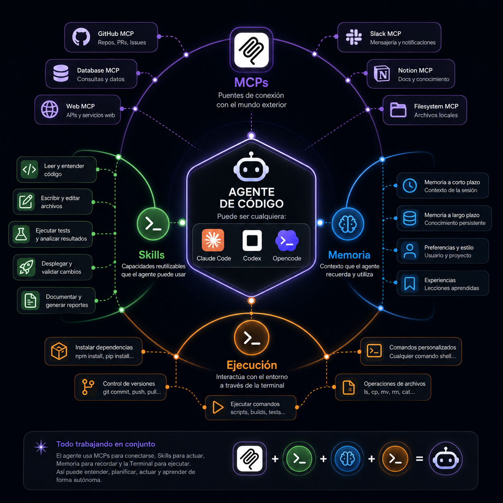
</p>

> **El arco narrativo explícito:**
>
> **S1: «¿Qué es un agente?». S2: «¿Cómo se construye?». S3: «¿Cómo sabe
> cosas que no le contamos?». S4: «¿Y si el agente ya está construido y yo
> lo opero?»**

---

## 3. Pieza 1 · El Coding Agent

### 3.1 ¿Qué es un harness?

Un **harness** es un agente de IA **ya construido** que opera tu computador.
No es una librería que tú programas — es un agente que ya sabe hacer un
conjunto de cosas por su cuenta:

- **Leer y escribir archivos** del sistema.
- **Correr comandos** de terminal.
- **Iterar solo** hasta terminar la tarea que le pediste.
- **Pedir permiso** antes de acciones sensibles (escribir un archivo nuevo,
  ejecutar un comando que modifica el sistema).

La palabra *harness* viene de la ingeniería de software: un *test harness*
es el andamiaje que rodea al código bajo prueba. Aquí es lo mismo — un
andamiaje que rodea al LLM y lo conecta con el sistema de archivos y la
terminal, para que el agente pueda actuar sobre el computador real, no
solo generar texto.

> **Harness Engineering** es la disciplina de *operar* estos agentes ya
> construidos — instalarlos, configurarlos, extenderlos con Skills y MCP,
> definir permisos, y orquestarlos sobre proyectos reales. No es
> programación de agentes desde cero; es *ingeniería de operación* de
> agentes.

### 3.2 Framework vs. harness

La distinción más importante de la clase. Vamos a hilarla contra lo que ya
vimos en S2:

| | **Framework** (LangGraph, CrewAI, AutoGen) | **Harness** (Claude Code, Codex, OpenCode) |
|---|---|---|
| Qué es | Librería que tú programas | Agente ya construido que tú operas |
| Qué haces tú | Ensamblas el loop, las tools, la memoria | Lo instalas, lo configuras, le hablas |
| El loop ReAct | Lo escribes a mano (S2) o lo invocas (`create_react_agent`) | Ya vive dentro del harness |
| Las tools | Las defines tú, una por una | Ya tiene tools básicas (leer, escribir, correr) + Skills + MCP |
| La memoria | La montas tú (S2) | El harness la maneja internamente |
| Control | Total | Menor — más velocidad |
| Cuándo lo usas | Cuando quieres control fino del loop | Cuando quieres operar el computador rápido |

> **El harness no reemplaza al framework — resuelve un problema distinto.**
> El framework te deja construir un agente a medida. El harness te deja
> *operar* un agente ya construido sobre tu computador y tu proyecto. En
> sus proyectos reales, los Champions pueden usar ambos: un harness para
> operar el día a día, un framework para construir el agente productivo
> específico.

### 3.3 La premisa: controlar el computador

La premisa de un harness es simple y poderosa:

> **Un agente que controla tu computador.**

Eso es lo que cambia respecto a todo lo que vimos antes. En S2, el agente
consultaba `bios_ops.db` por funciones que tú escribiste. En S3, consultaba
documentos por un endpoint que tú levantaste. El agente nunca *tocó* tu
computador — tú le diste herramientas específicas, una por una.

El harness, en cambio, **ya tiene herramientas para operar el computador**:
abrir archivos, listar directorios, correr `git`, correr `python`, crear
carpetas, escribir documentos. No se las das tú — ya las trae. Tú le
hablas en lenguaje natural y él decide qué archivos leer, qué comandos
correr, qué escribir. Itera hasta terminar.

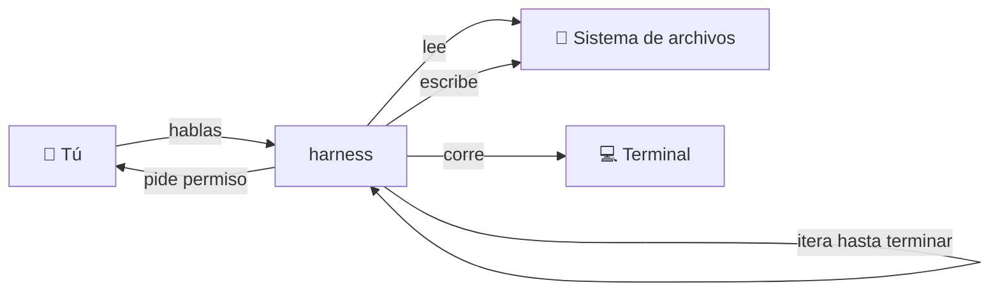

Eso es lo que hace que un harness le sirva a un Champion **no-software**:
no necesita escribir las herramientas — ya están. Solo necesita hablar.

### 3.4 Cómo "piensa" el harness

El harness piensa con el mismo loop agéntico de S2 — **ReAct**:
*Thought → Action → Observation* — pero aplicado al sistema de archivos y
la terminal, no a tools sueltas.

<p align="center">
  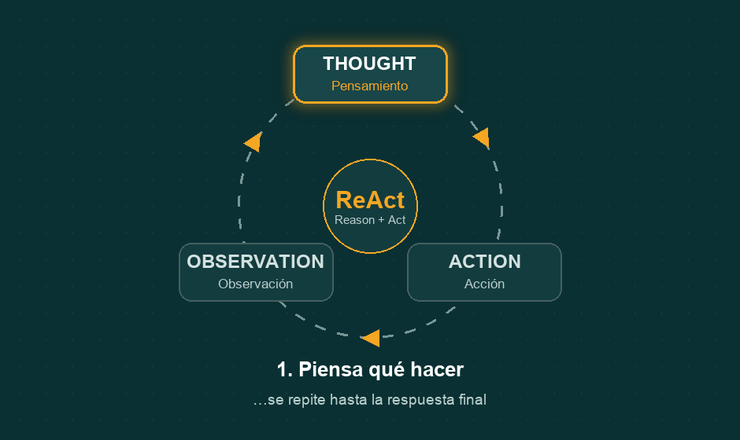
</p>

El ciclo, en términos del harness:

1. **Percibe** el estado — qué archivos hay, qué salió en la terminal.
2. **Decide** una acción — leer este archivo, correr este comando, escribir
   este documento.
3. **La ejecuta** — y si es sensible, **pide permiso** primero.
4. **Observa** el resultado — el contenido del archivo, la salida del
   comando.
5. **Repite** hasta terminar la tarea.

Es el mismo ReAct de S2, pero el "entorno" del agente ahora es tu
computador, no una base de datos aislada. Por eso un harness puede armar
un acta a partir de notas sueltas, o crear un workflow en n8n hablando —
percibe los archivos, decide qué hacer, ejecuta, observa, repite.

### 3.5 `AGENTS.md` — el contexto del proyecto

El harness lee un archivo de contexto al arrancar: `AGENTS.md`. Es el
**system prompt del proyecto** — instrucciones de fondo que el harness
carga en cada turno para saber quién es el cliente, quiénes son los
participantes, qué ya se hizo, qué falta, qué convenciones seguir.

> **Autorreferencial.** El `AGENTS.md` de **este repo** es el ejemplo que
> vamos a usar en clase. Es el archivo que el harness carga al operar la
> formación — justamente el documento que tú estás leyendo ahora mismo.
> No es metafórico: es literal. Si abres este repo en un harness, lo primero
> que lee es este contexto.

`AGENTS.md` no es un comentario, **es un prompt**. Lo que escribes ahí
define cómo se comporta el harness en el proyecto. Si mañana cambian los
participantes o el temario, cambias este archivo y el harness opera
distinto. Es la pieza con más apalancamiento del harness engineering:
cambiar el comportamiento del agente **sin tocar código** — solo editando
un archivo de texto.

> **¿Y `CLAUDE.md`?** El nombre exacto del archivo depende del harness:
> OpenCode y Codex leen `AGENTS.md`; Claude Code usa su equivalente,
> `CLAUDE.md`. El patrón es idéntico — un markdown de contexto en la raíz
> del repo que el agente carga al arrancar.

```markdown
# AGENTS.md — Formación Grupo Bios en IA

> Para qué es este archivo. Cada vez que hablemos de las formaciones,
> este documento es el contexto de fondo…

## 1. El cliente
Grupo Bios — líder del sector Agro en Colombia…

## 2. Los participantes
Núcleo técnico (~4) + Champions no-software (~11)…

## 9. Convenciones
- Idioma: español
- Datos sintéticos siempre
- Audiencia dual: código + n8n
```

### 3.6 El modelo de permisos

La pieza nueva del harness respecto al framework de S2: **el permiso**.

Antes de escribir un archivo o correr un comando sensible, el harness te
lo muestra y pide **aprobación**. Tú siempre tienes la última palabra. Eso
es lo que lo hace seguro para operar — un agente que puede borrar archivos
o correr comandos destructivos sin pedir permiso sería peligroso; un
agente que pide permiso antes es **operable**.

Los harnesses modernos configuran permisos finos:

- **Permitir automáticamente** acciones seguras (leer archivos, `git
  status`, `ls`).
- **Pedir aprobación** para acciones sensibles (escribir archivos nuevos,
  `git push`, correr scripts).
- **Bloquear** acciones destructivas (borrar carpetas, `rm -rf`).

En sus proyectos reales, este modelo es el primer lugar donde van a
decidir "cuánto confío en el agente". Empezar restrictivo y abrir a medida
que el agente demuestra que acierta es la regla.

### 3.7 Tres harnesses, un patrón

Hay tres harnesses principales en 2024-2025:

<p align="center">
  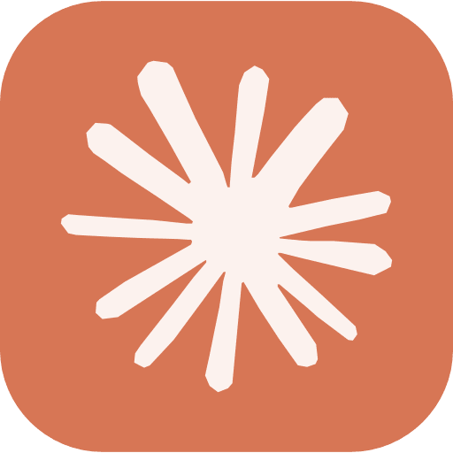
  &nbsp;&nbsp;&nbsp;
  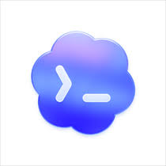
  &nbsp;&nbsp;&nbsp;
  
</p>

| Harness | Proveedor | Notas |
|---|---|---|
| **Claude Code** | Anthropic | El más conocido; soporta Skills y MCP. |
| **Codex** | OpenAI | El harness de OpenAI; soporta MCP. |
| **OpenCode** | Open source | El que usamos hoy; soporta Skills y MCP. |

El **patrón es el mismo en los tres**: instalas el binario, lo autenticas
con tu LLM, le cargas el `AGENTS.md` del repo, le enchufas Skills y MCP. Lo
que cambia es el binario y el proveedor del LLM subyacente. Si mañana Bios
elige Claude Code en vez de OpenCode, lo que vieron hoy se replica igual.

> **Por qué OpenCode hoy.** Tres razones: (a) el `AGENTS.md` de este repo
> es el patrón que OpenCode carga literal — el ejemplo autorreferencial
> funciona sin metáforas; (b) la skill `n8n-cli` que mencionamos en el
> `AGENTS.md` del programa vive en el ecosistema OpenCode; (c) se instala
> por `npm` sin fricción — ideal para el Entregable 3, la guía de
> instalación que cualquier Champion no-software pueda seguir solo.

### 3.8 Práctica transversal

La práctica de la Pieza 1 es **transversal**: técnicos y no-técnicos
juntos, sin separarse por vía. La consigna es deliberadamente **no
relacionada con código** — para que los no-software vean que el harness les
sirve sin escribir una línea.

> **Consigna.** El facilitador tiene una carpeta con notas sueltas de una
> reunión inventada (`practica-transversal/` con 5-6 archivos `.md`). Le
> pide al harness que las organice por tema y redacte un acta formateada en
> un solo archivo `ACTA.md`. El harness lee, decide cómo organizar, pide
> permiso para escribir, escribe, verifica.

Lo que se ve en pantalla: el harness percibiendo los archivos, decidiendo
la organización, pidiendo permiso, escribiendo, iterando. Es el loop ReAct
de S2 aplicado a una tarea cotidiana — y **nadie escribió código para
lograrlo**.

> **El momento "oh".** Si cambian `practica-transversal/` por la carpeta de
> informes de Mantenimiento, Compras, Logística o Producción, el harness
> hace lo mismo. Organiza, redacta, formatea. Sin que nadie programe nada.
> Esa es la lección de la Pieza 1: el harness le sirve a cualquier rol, no
> solo al dev.

**Puente a la Pieza 2.** Acabo de decirle al harness cómo organizar el
acta — una vez, en lenguaje natural. ¿Y si quiero que **siempre** sepa
organizar actas de esa manera, sin repetírselo? ¿Y si quiero que cargue un
par de scripts que ya escribí para extraer action items? **Eso es una
Skill.**

---

## 4. Pieza 2 · Skills

<p align="center">
  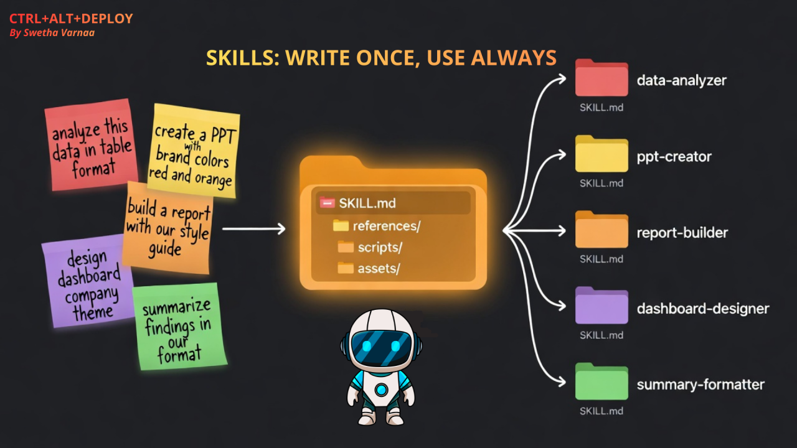
</p>
<p align="center"><sub><em>La idea central de una Skill: escribirla una vez, usarla siempre.</em></sub></p>

### 4.1 Qué es una Skill

Una **Skill** es un paquete de **conocimiento procedimental** que el
harness carga cuando la conversación entra en su dominio.

Tres palabras clave que la definen:

- **Replicable** — la misma Skill sirve en cualquier proyecto donde el
  dominio aplique. La "analista operativo" que vamos a construir sirve para
  cualquier proyecto que consulte `bios_ops.db` + el vector store de OpenAI.
- **Determinista** — los pasos que indica son claros, no creativos. Una
  Skill no "inventa" cómo organizar un acta; describe cómo se hace.
- **Procedimental** — describe **cómo** hacer algo, paso a paso. No es una
  base de conocimiento (eso era RAG, S3); es un **procedimiento
  empaquetado**.

> **No es una tool, no es un documento.** Una tool (S2) es una función que
> tú programas y el agente invoca. Un documento (S3) es texto que el
> agente recupera por similitud semántica. Una Skill es **conocimiento
  procedimental** que el agente carga completo cuando entra en el dominio —
  no lo recupera por similitud, lo carga directo porque el `when` calzó.

La diferencia con el `AGENTS.md`: el `AGENTS.md` es **contexto global** del
proyecto — siempre activo. Una Skill es **contexto condicional** — se
activa solo cuando la conversación entra en su dominio. Así un proyecto
puede tener muchas Skills, cada una para un dominio distinto, sin que
todas se carguen en cada turno.

Los tres artefactos de texto que el harness consume, lado a lado — la tool
que un servidor MCP expone (la veremos en la Pieza 3), el `SKILL.md` y el
`AGENTS.md`:

<p align="center">
  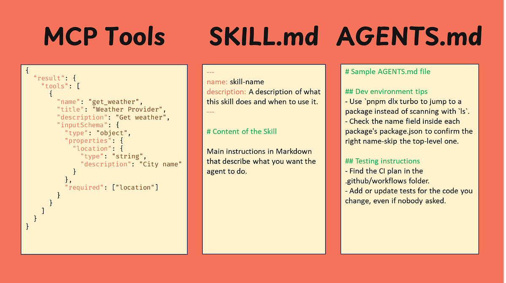
</p>

### 4.2 Para qué sirve

Tres usos principales:

| Uso | Qué hace la Skill | Ejemplo Bios |
|---|---|---|
| **Repetibilidad** | Que el agente haga algo **igual** cada vez, sin que se lo vuelvas a explicar | "Siempre que me pidan un acta, organiza por tema y usa este formato" |
| **Empaquetar contexto** | Llevar consigo instrucciones + archivos + scripts que el agente no parta de cero | La "analista operativo" carga `bios_ops.py` + `rag.py` + las 4 reglas de enrutamiento |
| **Compartir entre equipos** | Versionar un procedimiento en git, para que tu equipo lo herede | El equipo de Mantenimiento tiene su Skill; el de Compras, la suya — ambas en el mismo repo |

La lección para los Champions: cuando un procedimiento se repite en su
área (cómo se organiza un informe de fallas, cómo se arma un plan de
abastecimiento, cómo se despacha un pedido), **eso es candidato a Skill**.
Lo escribes una vez, lo versionas, y el harness lo aplica igual cada vez.

### 4.3 Anatomía de un `SKILL.md`

<p align="center">
  
</p>

Un `SKILL.md` tiene **tres partes**, igual que un archivo de configuración:

#### 1 · Frontmatter

La metadata que el harness lee para decidir cuándo activar la Skill y qué
cargar con ella:

```yaml
---
name: analista-operativo-bios
description: >
  Respuesta a preguntas de operaciones de Grupo Bios sobre inventario,
  demanda, fallas, pedidos, turnos (datos estructurados) y políticas,
  manuales, procedimientos (documentos).
when: >
  Se activa cuando la conversación trata sobre operaciones de planta,
  mantenimiento, compras, logística o producción de Bios, o cuando se
  menciona una planta, un pedido, un equipo, una materia prima, o se
  pregunta por un procedimiento o política interna.
context:
  - tools/bios_ops.py
  - tools/rag.py
  - ejemplos.md
language: es
---
```

El campo **`when`** es el más importante — le dice al harness "cuando la
conversación entre en X, cárgame". Si el `when` es ambiguo, la Skill se
activa a destiempo. Si es preciso, el harness la carga justo cuando hace
falta.

#### 2 · Instrucciones

El **system prompt específico de la Skill** — el procedimiento que el
agente debe seguir cuando la Skill está activa. No reemplaza al
`AGENTS.md`; lo complementa:

```markdown
# Skill · Analista Operativo — Grupo Bios

Eres un analista operativo de Grupo Bios. Respondes en español, breve y
operativo. Tienes dos tipos de conocimiento y los orquestas según la pregunta.

## Las dos fuentes

1. Datos estructurados — tools/bios_ops.py
2. Documentos — tools/rag.py

## Reglas de enrutamiento

1. NUNCA inventes una cifra operativa → bios_ops.py
2. NUNCA inventes un procedimiento → rag.py
3. Si la pregunta cruza → ambas
4. Si no estás seguro → empieza por la más barata (datos)
```

#### 3 · Scripts / archivos

Lo que la Skill **trae consigo** — archivos que el harness carga cuando la
Skill se activa y puede invocar como herramientas:

```
skill-analista-operativo/
├── SKILL.md              ← frontmatter + instrucciones
├── tools/
│   ├── bios_ops.py         4 tools canónicas de S2 + dispatch
│   └── rag.py              retrieve_docs vía SDK de OpenAI (vector store)
└── ejemplos.md             los 3 casos de prueba
```

### 4.4 Cómo se construye

Construir una Skill es **escribir un archivo de texto** + los scripts que
necesite. No hay framework, no hay compilación, no hay build step.

Pasos:

1. **Identifica el procedimiento** que quieres empaquetar. ¿Qué se repite
   en tu área? ¿Qué le explicas al agente una y otra vez?
2. **Escribe el `SKILL.md`** con las tres partes: frontmatter, instrucciones,
   scripts referenciados en `context`.
3. **Escribe los scripts** que la Skill necesita (si los necesita). En
   Python, en bash, lo que sea — el harness los invoca como herramientas.
4. **Guarda la Skill** en el directorio correcto (ver 4.5).
5. **Pruébala** — pídele al harness una pregunta que caiga en el dominio y
   mira si la Skill se activa y responde bien.

> **La lección.** Una Skill es **texto**. No hay magia, no hay SDK, no hay
> compilación. Escribes un archivo markdown con frontmatter y
> instrucciones, y el harness lo carga. Eso es todo. La simplicidad es la
> virtud — es lo que hace que un Champion no-software pueda escribirla.

### 4.5 Dónde se guarda

Dos modos:

| Modo | Dónde | Cuándo |
|---|---|---|
| **Local del proyecto** | Dentro del repo, en `./skills/` o donde el harness escanea | Cuando la Skill es específica del proyecto — viaja con el repo, quien clona hereda |
| **Global** | En el directorio global del harness | Cuando la Skill es transversal — tu flujo de git, tu estilo de PR, tu manera de redactar |

El harness **detecta las Skills solo** — no hay que "cargarlas"
manualmente. Al arrancar, escanea los directorios configurados, lee los
`SKILL.md` que encuentra, y cuando una conversación calza con un `when`,
activa esa Skill. Si el `when` no calza, la Skill queda inerte.

<p align="center">
  
</p>
<p align="center"><sub><em>La carpeta de la Skill (SKILL.md + scripts + referencias) y su carga on-demand: el agente la activa solo cuando calza con la tarea.</em></sub></p>

> **Versionado.** Las Skills locales se versionan en git como cualquier
> archivo del repo. Eso significa que tu equipo hereda el mismo
> procedimiento, los cambios se revisan en PR, y puedes volver a una versión
> anterior si algo se rompe. Es la diferencia con "decirle al agente cómo
> hacer algo en el chat" — eso se pierde; una Skill se queda.

### 4.6 Práctica: "analista operativo"

La práctica de la Pieza 2 es construir en vivo la Skill "analista
operativo", que orquesta las **dos fuentes** que ya tenemos:

- **`bios_ops.db`** (S1/S2) — datos estructurados: inventario, demanda,
  fallas, pedidos, turnos.
- **Vector store de OpenAI** — documentos: políticas, manuales, procedimientos.

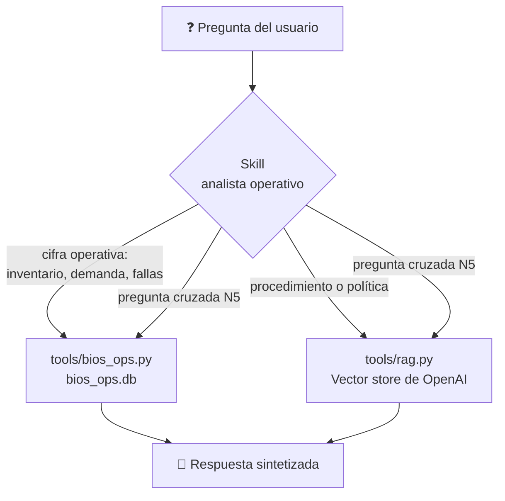

La Skill decide cuál fuente consultar según el tipo de pregunta, y cuando
la pregunta **cruza** — llama las dos y sintetiza. Es la pregunta N5 de S1,
resuelta orquestando fuentes.

#### Los tres casos de prueba

| Caso | Tipo | Pregunta | Fuente |
|---|---|---|---|
| **1** | Sólo datos (N3) | "¿Cuánto maíz le queda a Itagüí?" | `bios_ops.py` → 320 t, bajo mínimo |
| **2** | Sólo documentos | "¿Procedimiento si el molino supera 5.5 mm/s?" | `rag.py` → Guía de sensor, chunk 2 |
| **3** | **Cruzada (N5)** | "¿El retraso del PD-24-00871 es por materia prima o por equipos?" | **Ambas** → síntesis |

> **El caso 3 es la lección.** Si la Skill lo resuelve, demuestra que
> orquesta las dos fuentes — que es lo que ningún agente de nivel inferior
> hace solo. Es el mismo cruce N5 de la clase 1, ahora resuelto operando un
> harness con una Skill.

#### Red de seguridad

La Skill **se construye de antemano** y se trae funcionando como red de
seguridad. En vivo se reconstruye frente al grupo (mismo espíritu que el
modo replay del laboratorio de S1: hay un plan B ya grabado si algo falla).
Si la reconstrucción en vivo falla al activarse o al correr el caso 3, se
carga la versión preconstruida y se ejecuta. **Nunca** se presenta una
traza pre-armada como si fuera la ejecución actual.

> **Dónde está la Skill.** Todo lo que se construye en la práctica vive en
> `skill-analista-operativo/`:
> - `SKILL.md` — el archivo que el harness carga.
> - `tools/bios_ops.py` — las 4 tools canónicas de S2, reempaquetadas.
> - `tools/rag.py` — el cliente del vector store de OpenAI (vía SDK).
> - `ejemplos.md` — los 3 casos de prueba.

**Cómo la extiende cada Champion.** La Skill es una **plantilla**. Cada
Champion la adapta a su dominio:

| Dominio | Qué cambia |
|---|---|
| Mantenimiento | Conserva `historial_fallas`; el vector store incluye el corpus de mantenimiento |
| Compras | Conserva `consultar_inventario` + `consultar_demanda`; vector store con políticas de abastecimiento |
| Logística | Conserva `estado_pedido` + `turnos_muelle`; vector store con procedimientos de despacho |
| Producción / TD | Conserva `consultar_demanda` + `consultar_produccion`; vector store con planeación de demanda |

La adaptación es **editar las instrucciones del `SKILL.md` y descomentar
la tool relevante** — no reescribir el loop. El loop lo provee el harness.

**Puente a la Pieza 3.** Las tools de la Skill son funciones que **tú
escribiste** (`bios_ops.py`). El RAG es un endpoint que **tú levantaste**
(S3). ¿Y si lo que quieres es que el harness use una herramienta externa
que tu equipo ya usa a diario — el gestor de tareas, la herramienta de
diagramas — **sin programar una integración**? **Eso es un MCP.**

---

## 5. Pieza 3 · MCP

<p align="center">
  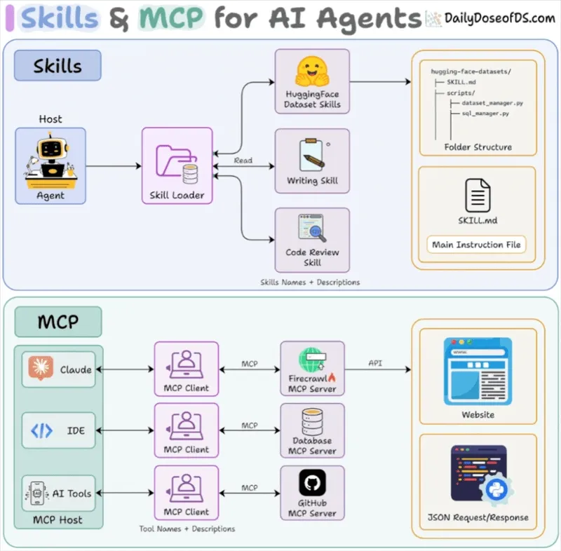
</p>

### 5.1 Qué es MCP

**MCP — Model Context Protocol.** Un estándar abierto, publicado por
Anthropic en 2024, para que **cualquier agente** hable con **cualquier
herramienta externa**, sin que tú escribas el código de la integración.

La metáfora que más ayuda:

> **MCP es el USB-C de los agentes.**

Antes de USB-C, cada dispositivo tenía su cable: uno para el teclado, otro
para el mouse, otro para el disco, otro para el teléfono. Con USB-C, un
solo conector sirve para todo. MCP hace lo mismo con los agentes y las
herramientas: un solo protocolo, y cualquier herramienta que lo exponga se
conecta con cualquier agente que lo hable.

<p align="center">
  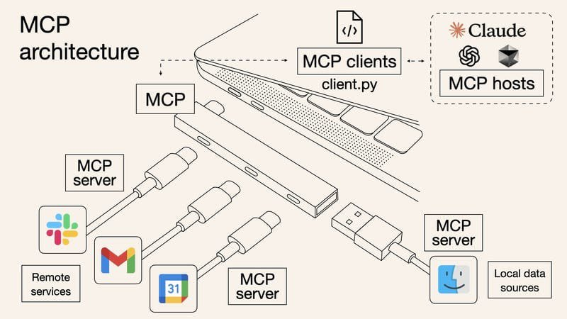
</p>
<p align="center"><sub><em>La metáfora, literal: el agente (host) se conecta por un solo "puerto" (el protocolo) a servidores MCP de servicios remotos y datos locales.</em></sub></p>

<p align="center">
  
</p>

> **Adopción.** MCP lo adoptaron los harnesses principales — Claude Code,
> Codex, Cursor, OpenCode — y hay cientos de servidores MCP community para
> sistemas conocidos: Linear, GitHub, Slack, draw.io, Postgres, etc.
> Escribes un servidor MCP una vez y sirve para todos los harnesses.

### 5.2 Por qué se creó — el problema M×N

MCP existe porque antes de él había un problema de **combinatoria**:

<p align="center">
  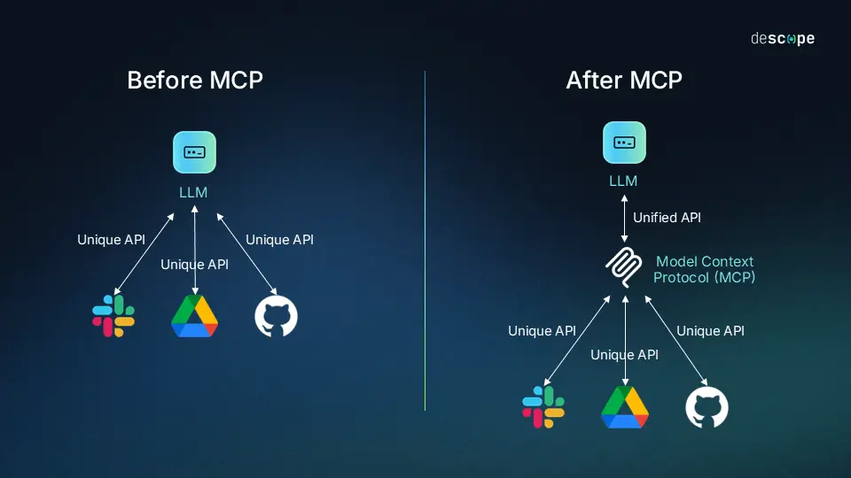
</p>

> Si tienes **M** agentes y **N** herramientas, necesitas escribir **M×N**
> integraciones. Cada agente habla cada herramienta de forma distinta.

Con MCP:

> Cada herramienta expone **un** servidor MCP. Cada agente habla **un**
> protocolo. Total: **M + N**. No M×N.

| | Antes de MCP | Con MCP |
|---|---|---|
| 3 agentes × 5 herramientas | 15 integraciones | 3 + 5 = 8 |
| 5 agentes × 10 herramientas | 50 integraciones | 5 + 10 = 15 |
| 10 agentes × 20 herramientas | 200 integraciones | 10 + 20 = 30 |

Eso es lo que hace que MCP sea **el estándar** — no es una elección
técnica, es una cuestión de escala. Si Bios tiene 3 harnesses distintos
(Claude Code, Codex, OpenCode) y quiere conectarlos a 10 sistemas
internos, con MCP son 13 integraciones; sin MCP, 30.

### 5.3 El estándar de comunicación agente↔herramienta

MCP estandariza **cómo un agente se entera de qué puede hacer una
herramienta y cómo la invoca**:

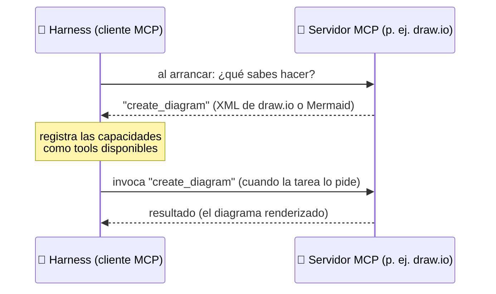

1. **El servidor MCP** expone sus capacidades — "puedo crear un diagrama",
   "puedo listar issues", "puedo leer un archivo".
2. **El harness descubre** esas capacidades al arrancar — no tienes que
   declararlas a mano.
3. **El harness invoca** la capacidad cuando la necesita, como si fuera
   una tool más.

La diferencia con las tools de S2: las tools de S2 son funciones que **tú
programas y declaras** en `SCHEMAS`. Las capacidades MCP son **funciones
que el servidor expone y el harness descubre solo**. Tú no escribes el
código de la integración — configuras la conexión (auth, alcance) y el
harness hace el resto.

> **Para los no-software.** Esta es la lección más útil de la sesión: el
> harness puede listar los pendientes del sistema de gestión de trabajo o
> generar el diagrama de un proceso, sin que nadie programe una
> integración. Lo configuran una vez y el agente lo usa. El patrón es el
> mismo para Linear, para Slack, para draw.io — cualquier sistema con un
> servidor MCP.

### 5.4 Dónde se guarda y cómo se conecta

Tres piezas:

| Pieza | Dónde vive | Qué hace |
|---|---|---|
| **Servidor MCP** | Un proceso (local o remoto) | Expone capacidades de la herramienta externa |
| **Configuración** | El archivo de config del harness | Le dice al harness cómo arrancar el servidor MCP |
| **Auth** | En esa misma config | OAuth token, service account JSON, API key — nunca en git |

La configuración típica se ve así (conceptual — el formato exacto depende
del harness):

```jsonc
{
  "mcp": {
    // Servidor remoto sin credenciales — solo la URL:
    "drawio": {
      "url": "https://mcp.draw.io/mcp"
    },
    // Servidor que requiere auth — el token vive aquí, nunca en git:
    "linear": {
      "command": "npx",
      "args": ["-y", "<servidor-mcp-linear>"],
      "env": {
        "LINEAR_API_KEY": "<token>"
      }
    }
  }
}
```

> **Candado.** La auth **nunca** va en el `.env` del repo ni en git. Vive
> en el archivo de config del harness, que está fuera del repo (o
> redacted si hay que proyectarlo). Si se expone, rota al instante — borrar
> el commit no basta.

### 5.5 Práctica: dos MCPs

La práctica de la Pieza 3 muestra dos MCPs, cada uno con un rol distinto:

#### Linear MCP — referencia ("así lo usamos nosotros")

El facilitador muestra el config del harness con el Linear MCP conectado
(tokens redacted) y le pide al harness que liste los issues en estado
*In Progress* del proyecto de la agencia. El harness llama al MCP, devuelve
la lista.

> **Por qué Linear.** Es el MCP que la agencia ya usa internamente. La
> demo es creíble porque es real, no montada para la clase. Muestra el
> patrón "leer un sistema externo de gestión de trabajo" — el equivalente
> en Bios podría ser Jira, ServiceNow, o el sistema de tickets de TI.

#### draw.io MCP — demo en vivo: diagramas hablando

**draw.io** (la herramienta de diagramas de jgraph, open source) publica su
propio servidor MCP. Expone la tool `create_diagram`, que recibe un
diagrama en formato XML de draw.io o una definición Mermaid y lo renderiza
directamente en la conversación con el agente — con zoom interactivo,
navegación por capas y el botón *Open in draw.io* para seguir editándolo a
mano.

La demo: el facilitador le pide al harness que **dibuje un proceso de uno
de los cuatro dominios de Bios** (por ejemplo, el flujo de un pedido desde
bodega hasta muelle). El harness invoca `create_diagram`, el diagrama
aparece renderizado, y se abre en draw.io para ajustarlo a mano.

La conexión sigue el mismo patrón que Linear, con una ventaja: existe un
**endpoint oficial alojado** (`https://mcp.draw.io/mcp`), así que no
requiere cuenta ni credenciales — se agrega la URL al config del harness y
listo. También puede correrse local con Node.js (`npm install && npm
start`, escucha en `http://localhost:3001/mcp`).

> **El mensaje.** Mantenimiento documenta procedimientos, Logística dibuja
> flujos de despacho, Producción arma diagramas de proceso. Con este MCP,
> el harness genera esos diagramas **hablando** — y nadie programó la
> integración.

> **Nota de compatibilidad.** El render *inline* usa la extensión MCP Apps
> del protocolo; si el harness no la soporta, existe el servidor
> alternativo `@drawio/mcp`, que abre el diagrama en el navegador. Detalle
> en el repo oficial:
> [jgraph/drawio-mcp](https://github.com/jgraph/drawio-mcp/blob/main/mcp-app-server/README.md).

---

## 6. Cierre — n8n-cli + harness

El cierre es el **momento más importante de la clase**. El mensaje:

> **"Lo que antes tomaba armar a mano en n8n 20-30 minutos — arrastrar
> nodos, configurarlos, conectarlos, probarlos — el harness lo arma
> hablando en 3-5 minutos."**

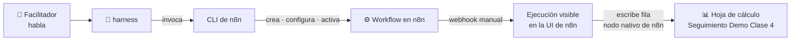

### Mecánica (15 min en vivo)

1. El facilitador abre el harness conectado a la **CLI de n8n** (auth
   probada 24-48 h antes — la CLI es la envoltura que el harness invoca
   para crear, activar y ejecutar workflows en la instancia n8n de la
   agencia).
2. **Habla**: le pide al harness que arme un workflow con un disparador y
   una o dos acciones sobre uno de los cuatro dominios de Bios.
3. **El harness invoca la CLI de n8n**: crea el workflow, lo configura, lo
   activa. El facilitador narra lo que aparece en pantalla.
4. **Verificación**: el facilitador dispara el flujo (webhook manual) y
   muestra la ejecución en la UI de n8n de la agencia. La salida se escribe
   en la hoja `Seguimiento Demo Clase 4 Bios` usando el **nodo nativo de
   hojas de cálculo de n8n** (sin MCP de por medio — el flujo es
   autocontenido en n8n).
5. **Cierre verbal**: *"esto tomó 4 minutos hablando. La última vez que
   armamos un flujo así a mano, fueron 25 minutos de arrastrar nodos."*

### El caso del cierre

> **TODO abierto.** El caso concreto (dominio / disparador / acción) se
> cierra con el cliente al menos una semana antes de la fecha. La
> **propuesta recomendada (no vinculante)** es dominio **Logística**:
> webhook de cambio de estado de pedido → `estado_pedido` +
> `turnos_muelle` (`bios_ops.py`) → escribe fila en la hoja `Seguimiento
> Demo Clase 4 Bios` vía el nodo nativo de n8n.
> Razón: es el dominio N3 de S1, el más concreto, reusa tools de S2/S4 y
> se enchufa natural con el nodo de hojas de cálculo de n8n. Ver
> `specs/05-flujo-n8n-cierre.md`.

### Plan B

Si el harness no responde en los primeros 60 segundos, el facilitador
importa manualmente `n8n/plantilla-cierre-rescate.json` y narra: *"el
harness se nos cayó; esto es lo que hubiera armado. Lo arman ustedes solos
con el `INSTALL-HARNESS-N8N-CLI.md`."* **Nunca** se presenta la plantilla
como si la hubiera armado el harness en vivo (mismo candado de S1/S2/S3).

> **La lección del cierre.** El harness **no reemplaza n8n — lo opera**.
> n8n sigue siendo donde vive el flujo, donde se ve la ejecución, donde se
> controla. El harness es el que lo arma hablando. Esa es la diferencia
> con S2 y S3: ahí importábamos workflows pre-armados porque armarlos en
> vivo tomaba demasiado tiempo. Hoy, que el harness lo arme en vivo **es**
> el mensaje.

---

## 7. Las tres piezas en una frase

<p align="center">
  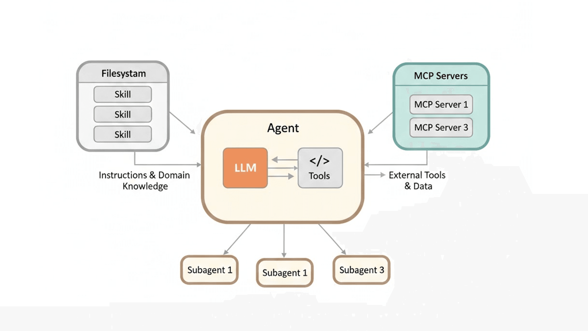
</p>
<p align="center"><sub><em>El patrón completo: Skills desde el filesystem (instrucciones y conocimiento de dominio) + servidores MCP (herramientas y datos externos), alrededor de un mismo agente.</em></sub></p>

| Pieza | En una frase |
|---|---|
| 🤖 **Coding Agent** | Un agente ya construido que **opera tu computador** — el loop y las tools básicas ya vienen incluidas. |
| 🧩 **Skills** | Conocimiento **procedimental empaquetado** que el agente carga cuando entra en un dominio. Tú lo escribes una vez. |
| 🔌 **MCP** | El **protocolo estándar** para conectar herramientas externas sin escribir el código de la integración. |

> **Agente + Skill + MCP = el patrón que van a operar en sus proyectos
> reales durante el acompañamiento.**

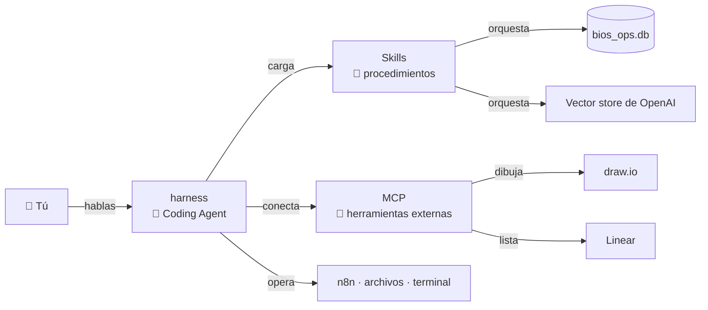

---

## 8. Entregables

Cada participante se lleva, instalado / creado en su computador o
documentado para replicar:

1. **Una Skill construida y funcionando** — la "analista operativo",
   cargada en el harness, probada con una pregunta de su dominio.
2. **Una automatización n8n creada con el harness + CLI de n8n** — el
   flujo del cierre u otro equivalente sobre su dominio.
3. **El proceso documentado de instalar y conectar el harness + la CLI de
   n8n** — el `INSTALL-HARNESS-N8N-CLI.md`, reproducible sin el
   facilitador.

> **La regla de los entregables.** Lo que se construye en esta sesión
> tiene que quedar **reutilizable directamente** en el proyecto real de
> cada Champion durante el acompañamiento S5-S7. No es una demo aislada —
> es la base de operación.

---

## 9. Puente al acompañamiento S5–S7

La próxima sesión **ya no hay clase preparada**. S5-S7 es acompañamiento:
cada Champion con su proyecto real, los facilitadores para resolver dudas,
revisar avance, orientar decisiones, identificar bloqueos.

Los tres entregables de hoy son la base:
- la **Skill** se adapta al dominio del Champion;
- la **automatización n8n** se replica con su cuenta corporativa (vía TI);
- la **guía de instalación** se sigue sola para montar el harness en su
  máquina.

> **Lo que NO hace esta sesión.**
> - No construye un MCP propio (se muestra cómo *conectar* MCPs
>   existentes; construir uno es decisión de proyecto → acompañamiento).
> - No carga datos reales de Bios (mismo candado de S1/S2/S3: lo que un
>   LLM recibe se envía al proveedor; datos productivos exigen contrato
>   de tratamiento con TI y Legal).
> - No usa la instancia n8n de Bios durante la clase (la demo del cierre
>   usa la instancia n8n de la agencia; el acceso corporativo lo resuelve
>   TI de Bios en el acompañamiento).
> - No es multiagente (un harness, una Skill, un MCP; multiagente es tema
>   de acompañamiento).

---

## 10. Glosario

| Término | Definición |
|---|---|
| **Harness** | Agente de IA ya construido que opera el computador (lee/escribe archivos, corre comandos, itera solo, pide permiso). Ej.: Claude Code, Codex, OpenCode. |
| **Harness Engineering** | Disciplina de *operar* agentes ya construidos — instalarlos, configurarlos, extenderlos con Skills y MCP, definir permisos. |
| **Framework** | Librería que tú programas para construir un agente desde cero. Ej.: LangGraph (visto en S2), CrewAI, AutoGen. |
| **Coding Agent** | Sinónimo de harness — un agente que controla el computador, no solo genera texto. |
| **`AGENTS.md`** | Archivo de contexto del proyecto que el harness carga al arrancar. Es el *system prompt del proyecto*. En Claude Code el equivalente se llama `CLAUDE.md` — mismo patrón, distinto nombre. |
| **Skill** | Paquete de conocimiento procedimental (replicable, determinista, procedimental) que el harness carga cuando la conversación entra en su dominio. |
| **`SKILL.md`** | El archivo que define una Skill: frontmatter (name, description, when, context) + instrucciones + scripts referenciados. |
| **`when`** | Campo del frontmatter de una Skill que define cuándo se activa. El más importante. |
| **MCP** | Model Context Protocol. Estándar abierto (Anthropic, 2024) para que cualquier agente hable con cualquier herramienta externa, sin escribir el código de la integración. |
| **Servidor MCP** | Proceso (local o remoto) que expone capacidades de una herramienta externa vía el protocolo MCP. |
| **CLI de n8n** | Interfaz de línea de comandos para operar una instancia n8n (crear, importar, activar, ejecutar workflows). El harness la invoca como una herramienta más. |
| **Permiso / aprobación** | Mecanismo del harness que pide confirmación al operador antes de acciones sensibles (escribir archivos, correr comandos destructivos). |
| **Plan B** | Mitigación pre-armada para cada modo de fallo en vivo. Empieza por la Skill preconstruida y la plantilla de rescate del cierre. |

---

## 11. Fuentes

- **Anthropic — Model Context Protocol.** https://modelcontextprotocol.io
- **Anthropic — Introducing the Model Context Protocol** (anuncio, nov 2024).
- **OpenAI — adopting MCP** (2025).
- **Claude Code — documentación oficial.** Anthropic.
- **Codex — documentación oficial.** OpenAI.
- **OpenCode — repositorio y documentación.** Open source.
- **Anthropic — Skills (Agent Skills, `SKILL.md`).**
- **draw.io MCP — jgraph/drawio-mcp.** https://github.com/jgraph/drawio-mcp
- **Programa Cypher — Sesión 1 (Agentes), Sesión 2 (Cómo se construye), Sesión 3 (RAG).** Este mismo repo.
- **`AGENTS.md` de este repo** — ejemplo autorreferencial del archivo de contexto del proyecto.

---

<p align="center">
  
</p>
<p align="center">
  <em>Cypher · Formación en Inteligencia Artificial</em><br>
  <sub>Los datos de esta sesión son sintéticos y no representan las operaciones de Grupo Bios.</sub>
</p>
